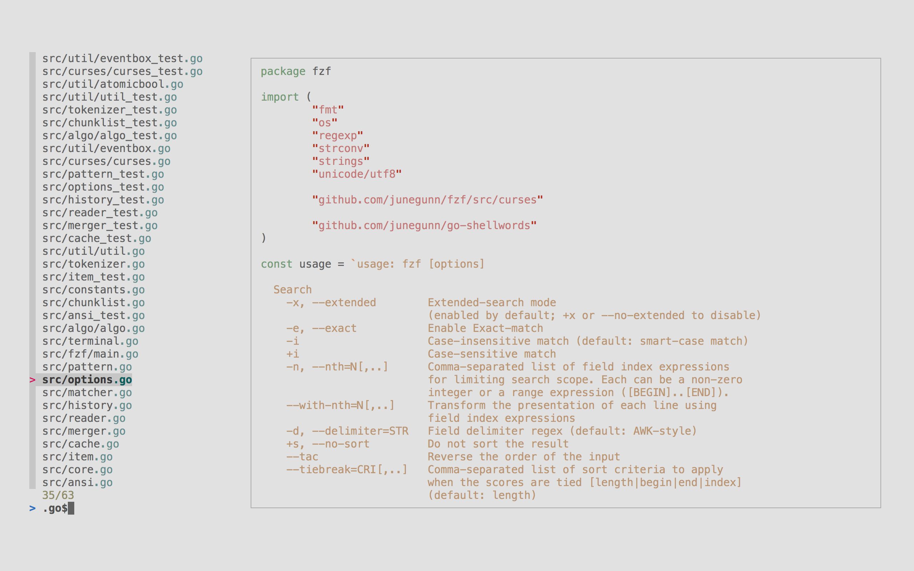
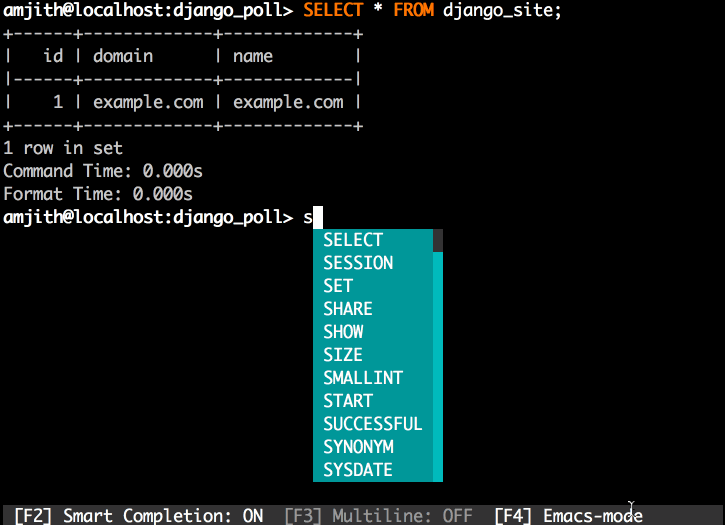

# So you think you like a GUI?

---

Fact: A terminal is way better.

--->

Why?

<!--
Using the CLI can seem old school. Maybe it is. But it's great.
-->

--->

It's fast

<!--
A GUI still cannot do everything the CLI can do.
And even for the parts that it can do, the CLI is usually faster, more flexible, can be scripted, and is scalable.
--->

--->

It's universal

--->

It's scriptable

<!-- Note: I made 50 PRs yesterday all doing the same. A quick shell script was super easy to write. Doing it via GUI would have been a nightmare. -->

--->

You don't need a mouse

--->

Because Vim.

Wait, [wrong slides](https://gidgidonihah.github.io/slides/vim/).

--->

And there’s a standard.

POSIX

<!-- Not gonna cover this. -->

---

Lots we could cover here.

We're not gonna cover it all.

--->

## Let's skip the basics:

<br>

* cd
* cp
* echo
* ls
* mkdir
* mv
* pwd
* whoami

<br>
We know all this stuff. If you don't, go read a [primer]( https://developer.mozilla.org/en-US/docs/Learn/Tools_and_testing/Understanding_client-side_tools/Command_line ).

--->

## And we'll skip the slightly less basics:

base64, cat, curl, env, export, find, locate, which, grep, head, history, ping, source, tail, tree, wget, exit, wc
chmod, crontab, df, du, kill, ln, rsync, scp, ssh, sudo, traceroute, unset, uptime, yes

etc.

--->

## Not even covering the slightly more advanced:

awk, cut, ifconfig, ps, sed, sort, top, uniq, xargs

--->

But you should know those things, so if you don't, go do some research.

--->

But actually if you want to talk about those, we can.

If there's time.

---

# A CLI is great

Terminal commands are like legos. Put them together to do cool things.

--->

Typically, they do one thing, and do it well.

--->

Chain multiple things together. Make a pipe.

Then smoke it.

--->

What's that? You want a contrived example? Great!

<br>

I have one of those right here:
```csv
foo,bar,baz
omg,wtf,bbq
foo,wtf,flerg
abc , 123 , baby you and me
```

--->

Naturally we want all the unique items from the first and last columns
without any leading/trailing whitespace, sorted alphabetically.

<br>
I mean what else could we possibly want to do?

--->

So let's make a pipe with `cat`, `awk`, `sort` and `uniq`.

```sh
cat data.csv | awk -F ',' '{print $1}{print $3}' | \
  sort | uniq | awk '{$1=$1};1'
```
<br>
Robert is your father's brother:
```
baby you and me
uandme
abc
baz
bbq
flerg
foo
omg
```

---

# Cool

So what do I need to have an awesome development environment?

--->

## Well, start with zsh.

It's more awesomer than bash.

(I've [talked about zsh](https://gidgidonihah.github.io/slides/zsh/) before.)

Sprinkle in some [Oh My Zsh](https://ohmyz.sh).

--->

## Make yourself a dotfile repo

I [have one](https://github.com/gidgidonihah/.dotfiles). You can too.

--->

## Create a good rc file

Use zsh? `.zshrc`

Use bash? `.bashrc`

You know about `/etc/profile.d`, right?
Make your own. Keep it organized.

```
 # Source the zsh profile scripts
 # See .profile.d/common.sh for shared (bash/zsh) settings
 # See .profile.d/aliases.sh for commonly used aliases # See .profile.d/functions.sh for commonly used functions
 for f in ~/.profile.d/*.zsh ~/.profile.d/*.sh; do
     source $f
 done
```

--->

## Set up a good prompt

[PowerLevel10k](https://github.com/romkatv/powerlevel10k)


--->

## Set up some aliases

Some handy examples:

```
alias rm='rm -i'
alias dc='docker compose'
alias ip="ifconfig en0 | awk '$1 == "inet" {print $2}'" # Get your IPv4 IP address from ifconfig.
alias gti='git'
alias ff="fzf --preview 'bat --color=always --style=numbers --line-range=:500 {}'"
alias nonet="sandbox-exec -f ~/no-network.sandbox"
alias imgdim='sips -g pixelHeight -g pixelWidth $1'
```

--->

## Create topic specific files

```
touch `~/.profile.d/owlet.sh`
```

```
alias owlint="black --config $OWLET_PYPROJECT_FILE . && isort --settings-path $OWLET_PYPROJECT_FILE --src . ."
```

--->

## Bash and Zsh?

Some things I want to run only when a bash shell starts. Some only zsh. Some both

Enter file extensions.

`.bash` for Bash.

`.zsh` for Zsh.

`.sh` for both.

--->

## Don't want to commit some files?

```
touch `~/.profile.d/thing.private.sh`
```

```
alias fbtokendev='getfbtoken my-private-api-token'
export HOMEBREW_GITHUB_API_TOKEN=ghp_NOYOUMAYNOT
export GITHUB_TOKEN=ghp_NOTTHISONEEITHER
```

(be sure you ignore `*private*`)

Better yet, store these things on the keychain and source them from there.

--->

## Completion files

Tab completion is a must have, but not everything tab completes by default.

Fix that by adding completion files.
```
ls ~/.profile.d/*complet*
~/.profile.d/aws-completion.bash
~/.profile.d/django-bash-completion.bash
~/.profile.d/drone-completion.bash
~/.profile.d/drone-completion.zsh
~/.profile.d/git-completion.bash
```

```
cat ~/.profile.d/aws-completion.bash
complete -C '/usr/local/bin/aws_completer' aws
```

--->

## Set up config for how you like it

```
export BROWSER=safari
export FPP_DISABLE_SPLIT=false
export EDITOR='/usr/local/bin/vim'
export LESS="-SFXR -x2"
export PAGER=less
```

--->

## Write some functions

```
function ssh-id-copy(){
    SERVER=$1;
    cat ~/.ssh/id_rsa.pub | ssh $SERVER 'cat >> ~/.ssh/authorized_keys'
}
rainymood() {
    FILE=$((RANDOM%4))
    URL="https://rainymood.com/audio1110/${FILE}.ogg"
    mpv "$URL" && rainymood
}
```

---

# Tips and tricks

We all know these already tho, right?

--->

Need to save output to a file?

Enter `>`

```sh
echo 'We know this already' > status.txt
```

Saves the output to a file and ***replaces everything already there***.

--->

"But I don't want to do that." You might say. "Can I append it?"

Sure. `>>`

```sh
echo 'but, it is still fun to talk about' >> status.txt
```

--->

"But I don't want any output at all. No errors, no text. Just run and don't let me know what happened. That seems sane, right?"

<br>

No, probably not. But let's do it anyway.

```sh
ls /tmp /not-a-real-directory > /dev/null 2>&1
```

<!--
https://stackoverflow.com/questions/818255/in-the-shell-what-does-21-mean
`1`: STDOUT
`2`: STDERR
`>&`: Redirects a stream to another file descriptor
-->

--->

## Is there a `<`?

Yes.


--->

Feeling random?

Me too:
```
$ echo $RANDOM
$ od -N10 < /dev/random
```

--->

## Less is more

Y'all know about `$PAGER`, right?

--->

## Bang Bang


```
./make-me-a-sandwhich.sh
```

```
sudo !!
```

```
echo 'long command I did in a single line for some reason' | ...
```

```
echo "!!" > script.sh
```

--->

## Magic Enter

```sh
 # load terminfo modules to make the associative array $terminfo available
zmodload zsh/terminfo

 # calculate how many lines one half of the terminal's height has
halfpage=$((LINES/2))

 # construct parameter to go down/up $halfpage lines via termcap
halfpage_down=""
for i in {1..$halfpage}; do
  halfpage_down="$halfpage_down$terminfo[cud1]"
done

halfpage_up=""
for i in {1..$halfpage}; do
  halfpage_up="$halfpage_up$terminfo[cuu1]"
done

magic-enter () {
    if [[ -z $BUFFER ]]
    then
            print ${halfpage_down}${halfpage_up}$terminfo[cuu1]
            zle reset-prompt
    else
            zle accept-line
    fi
}
zle -N magic-enter
bindkey "^M" magic-enter
```

--->

## Shortcuts

* `ctrl-d`: Exit/Quit

* `ctrl-a`: Jump to the start of the line

* `ctrl-e`: Jump to the end of the line

Better yet...

--->

## .inputrc

Change your input mode.

(To vi. Cause vi > emacs)

```
set editing-mode vi
set completion-ignore-case on
```

--->

## Where's the manual?

Right here:

```
man man
```

--->

## Too long; Did not read

Understood.

```
tldr man
```

More about this in a minute.

---

# Awesome tools


• [bat](https://github.com/sharkdp/bat)
• [caniuse-cli](https://github.com/dsenkus/caniuse-cli)
• [diff-so-fancy](https://github.com/so-fancy/diff-so-fancy)
• [entr](https://eradman.com/entrproject/)
• [fzf](https://github.com/junegunn/fzf)
• [gistup](https://github.com/mbostock/gistup)
• [github-cli](https://cli.github.com)
• [gping](https://github.com/orf/gping)
• [Grip](https://github.com/joeyespo/grip)
• [gron](https://github.com/tomnomnom/gron)
• [hey](https://github.com/rakyll/hey)
• [homebrew](https://brew.sh)
• [httpie](https://httpie.io/cli)
• [jq](https://stedolan.github.io/jq/)
• [yq](https://github.com/mikefarah/yq)
• [dbcli](https://www.dbcli.com)
  - [iredis](https://www.pgcli.com)
  - [litecli](https://litecli.com)
  - [mycli](https://www.mycli.net)
  - [pgcli](https://www.pgcli.com)
• [The Fuck](https://github.com/nvbn/thefuck)
• [tldr](https://github.com/tldr-pages/tldr)
<ul>

--->

## bat

A cat clone with wings.


--->

## caniuse-cli

Command line tool for caniuse database.


--->

## diff-so-fancy

Strives to make your diffs human readable.


--->

## entr

Run arbitrary commands when files change

```
ls | entr make
```

```
find tests '*.py' | entr -cs "pytest -s"
```

--->

## fzf

Command-line fuzzy finder.




--->

### Ctrl-R

fzf can also remap your history to fuzzy find.

--->

## gistup

Create a gist from the command line! Then just use git to update it.

```
gistup --private -- example.py
```

```
vi example.py
git commit -m 'Made some awesome changes.'
git push
```

--->

## github-cli (gh)

GitHub CLI brings GitHub to your terminal.


--->

## gping

Ping, but with a graph.


Hrm. This is getting uncomfortably close to a GUI.

--->

## Grip

GitHub Readme Instant Preview

```
$ cd myrepo
$ grip
 * Running on http://localhost:6419/
```

--->

## gron

Make JSON greppable!

```
$ gron "https://api.github.com/repos/tomnomnom/gron/commits?per_page=1" | grep commit.author
json[0].commit.author = {};
json[0].commit.author.date = "2020-11-07T01:17:42Z";
json[0].commit.author.email = "mail@tomnomnom.com";
json[0].commit.author.name = "Tom Hudson";
```

--->

## hey

A tiny program that sends some load to a web application.

```
$ hey https://accounts.dev.owletdata.com

Summary:
  Total:	3.7338 secs
  Slowest:	3.3133 secs
  Fastest:	0.0393 secs
  Average:	0.6795 secs
  Requests/sec:	53.5645

  Total data:	187270 bytes
  Size/request:	936 bytes

Response time histogram:
  0.039 [1]	|
  0.367 [113]	|■■■■■■■■■■■■■■■■■■■■■■■■■■■■■■■■■■■■■■■■
  0.694 [21]	|■■■■■■■
  1.022 [1]	|
  1.349 [25]	|■■■■■■■■■
  1.676 [12]	|■■■■
  2.004 [6]	|■■
  2.331 [9]	|■■■
  2.659 [11]	|■■■■
  2.986 [0]	|
  3.313 [1]	|

Latency distribution:
  10% in 0.0988 secs
  25% in 0.1035 secs
  50% in 0.2105 secs
  75% in 1.2762 secs
  90% in 2.2972 secs
  95% in 2.3995 secs
  99% in 2.5174 secs

Details (average, fastest, slowest):
  DNS+dialup:	0.1259 secs, 0.0393 secs, 3.3133 secs
  DNS-lookup:	0.0666 secs, 0.0000 secs, 0.2665 secs
  req write:	0.0000 secs, 0.0000 secs, 0.0005 secs
  resp wait:	0.5015 secs, 0.0392 secs, 2.8159 secs
  resp read:	0.0001 secs, 0.0000 secs, 0.0020 secs

Status code distribution:
  [200]	122 responses
  [429]	78 responses
```

--->

## Homebrew

The Missing Package Manager for macOS (or Linux)

```
brew install tldr
```

--->

## httpie

Curl, but you know, better.

```
$ http PUT httpbin.org/status/418
HTTP/1.1 418 I'M A TEAPOT
Access-Control-Allow-Credentials: true
Access-Control-Allow-Origin: *
Connection: keep-alive
Content-Length: 135
Date: Sat, 12 Mar 2022 01:06:18 GMT
Server: gunicorn/19.9.0
x-more-info: http://tools.ietf.org/html/rfc2324


    -=[ teapot ]=-

       _...._
     .'  _ _ '.
    | ."' ^ '". _,
    \_;'"---"'|//
      |       ;/
      \_     _/
        '"""'
```

--->

## jq

A lightweight and flexible command-line JSON processor.

```
$ curl 'https://api.github.com/repos/stedolan/jq/commits?per_page=5' | jq -r '.[0].sha'
a9f97e9e61a910a374a5d768244e8ad63f407d3e
```

--->

## yq

jq for yaml.

```
$ curl https://raw.githubusercontent.com/mikefarah/yq/master/.golangci.yml | yq -r .run.timeout
"5m
```

--->

## dbcli

CLI for DBs with auto-completion and syntax highlighting.

CLIs for mysql (mycli), postgres (pgcli), redis (iredis), sqlite (litecli) and others.



--->

## The Fuck

Corrects errors in previous console commands.


--->

## TL;DR

Collaborative cheatsheets for console commands.


---

## What did I miss?

What do you use that I don't (yet)?

What else should we talk about?

---

# References

+ https://www.howtogeek.com/437682/command-lines-why-do-people-still-bother-with-them/
+ https://developer.mozilla.org/en-US/docs/Learn/Tools_and_testing/Understanding_client-side_tools/Command_line
+ https://eds-uga.github.io/cbio-x835-sp20/slides/CommandLine.slides.pdf
+ https://stackoverflow.com/questions/818255/in-the-shell-what-does-21-mean
