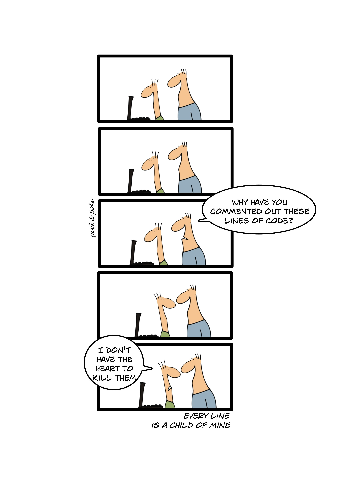
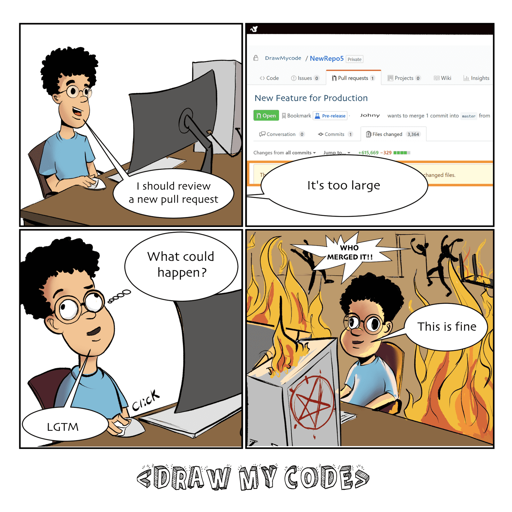
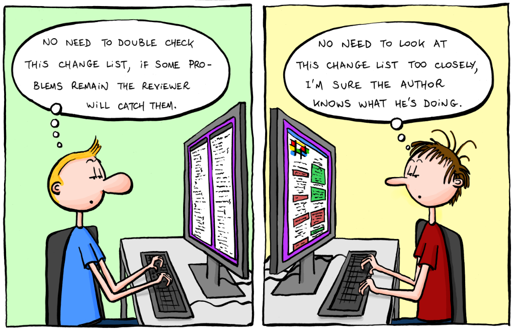
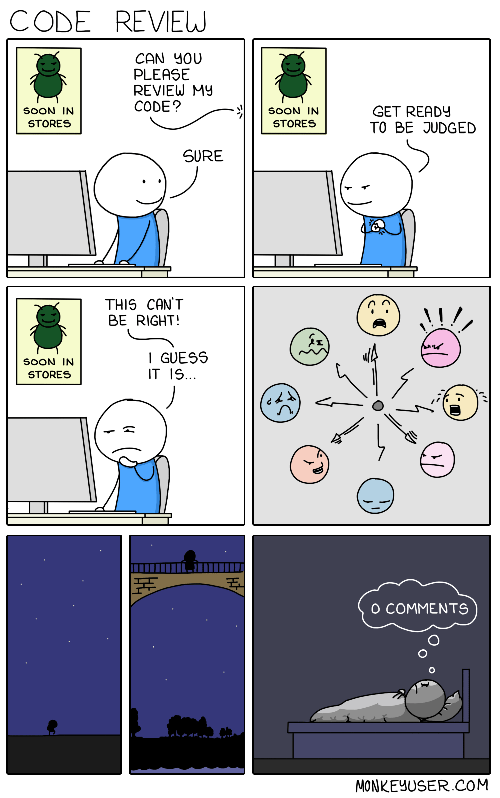
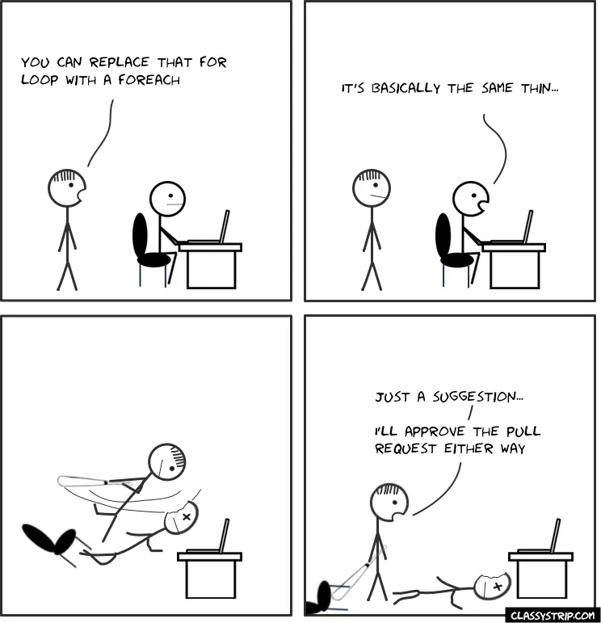
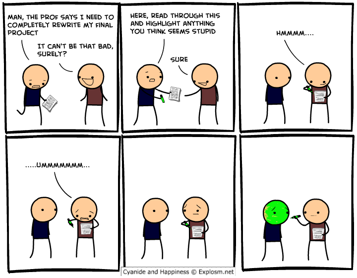
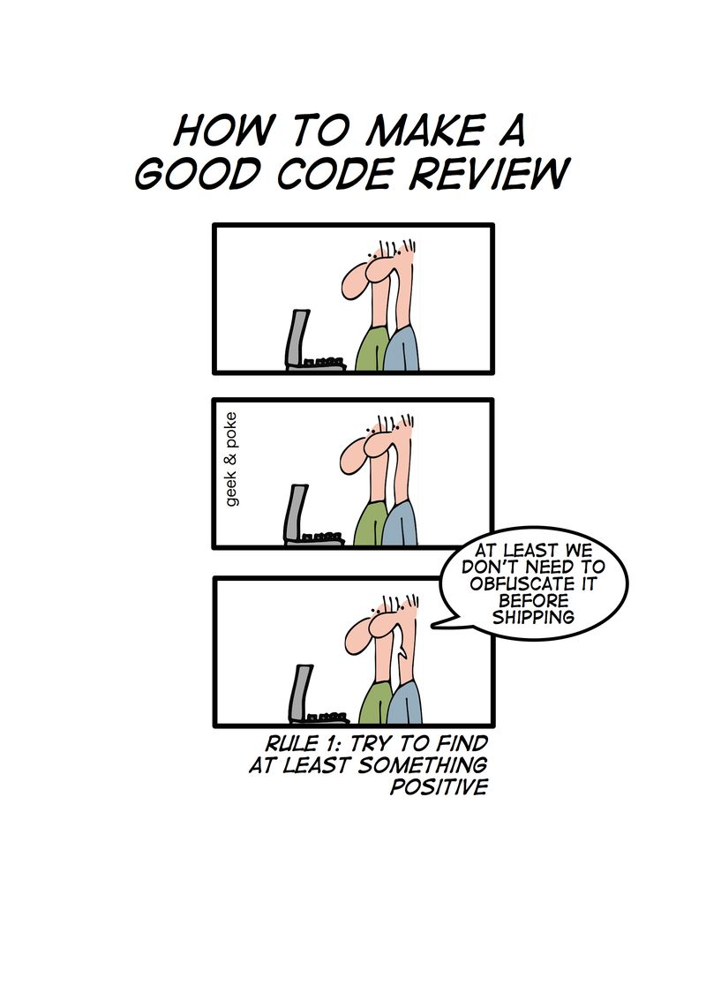
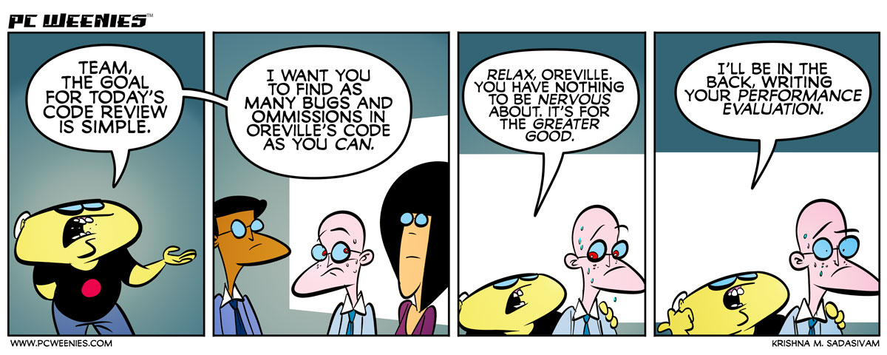

# Code Reviews

## How to give them and how to prepare for them

---

## What is a Code Review

--->

Note: We all know what it is.
It requires changes to be made.
If you never submit code, it never improves.
Likewise, if we make it too hard to get approved, it never improves.
On the other hand, we have to make sure code health is never decreasing.
It's a balance.

---

## Why do we do them?

--->

### To catch mistakes?

Note: Yeah, sure. Absolutely. Always good to catch a mistake before things go live.
But it's more than that.

--->

### For better code.

--->

> Codebases degrade through small decreases in code health over time.
> — [Google eng-practices](https://google.github.io/eng-practices/review/reviewer/standard.html)

--->

### For better devs.

Note: Not always obvious that this is a reason. We *all* can learn something from each
other. If we can't, we're not learning enough on our own.

--->

---

### Who should do them?

--->

[source](http://motionpictures.org/2016/07/comic-con-big-bang-theory-writers-panel/)

Note: Certainly not this guy.

--->

[source](https://goomics.net/67/)

Note: Not these guys. The author isn't doing any favors either.

--->

[source](https://www.monkeyuser.com/2019/code-review/)

Note: Still no. Better. But, you know, without the judgement.

--->

#### Everyone.

Note: Everyone. Everyone should do them. The author. The domain expert. The new guy. Not
all of them every time (other than the author), but they should all be involved.

---

## How do I do it?

--->

> A reviewer has ownership and responsibility over the code they are reviewing.
> — [Google eng-practices](https://google.github.io/eng-practices/review/reviewer/standard.html)

Note: A git blame is gonna show the committer. But the reviewer should feel the same
responsibility and ownership.

--->

## So you're saying I should pick *all* the nits!

No.

--->

> In general, reviewers should favor approving a PR once it is in a state where it
> definitely improves the overall code health of the system being worked on, even if the
> PR isn't perfect.
> — [Google eng-practices](https://google.github.io/eng-practices/review/reviewer/standard.html)

--->

## As the author, review your own code.

Run through your PR [as if you were your own
reviewer](https://sophiabits.com/blog/review-your-own-prs). You'd be surprised by what you
find. Only after that should you ask for a review from others.

--->

## Start by checking the basics

* Are the title and description sufficiently detailed?
* Is the PR appropriately sized?
* Have all the CI checks passed?
  * If not, let the author know.

--->

## Follow these principles

* Facts & data overrule opinions
* On matters of style, only style guides matter
* Failing all other rules, be consistent
* The author is the author. You are not the author.*

 
 
 
*Unless you are the author. Then, obviously, you're the author.

Note: The author is the author:

If the author can demonstrate (either through data or based on solid engineering
principles) that several approaches are equally valid, then the reviewer should accept
the preference of the author.  Otherwise the choice is dictated by standard principles
of software design.

--->

## Resolving reviewer conflicts

* Try to come to a consensus
* Have a face to face conversation
  * Record the result of the conversation **on the PR**.
* Escalate

Note: Escalate to a team discussion. Failing that a team lead or manager can make the
call.

---

### What should a reviewer look for?

* Design
* Functionality
* Complexity
* Tests
* Naming
* Comments
* Style
* Documentation

--->

#### Design

Is the code well-designed and appropriate for your system?

* Does it make sense?
* Does it belong?
* Does it integrate?
* Is now the right time?

--->

#### Functionality

Does the code behave as the author likely intended? Is the way the code behaves good for its users?

* Does it do what was intended?
* Is the intention good for users?
* Are there edge cases?
* Was it demoed (if needed)?

Note: Users in this context are consumers and future developers working on this code.

We should expect that changes are tested well enough that they work, but sometimes we miss things.

Think like a user. Think like QA. Think about exceptions. Think about race conditions. Think about security. Think about bugs.

Sometimes it's hard to tell the impact from the code. Here's looking at you frontend. Bring up and run the branch, or ask for a demo

--->

#### Complexity

Could the code be made simpler? Would another developer be able to easily understand and
use this code when they come across it in the future?

* Is this code too complex?
    - Are classes too complex?
    - Are functions too complex?
    - Are individual lines too complex?

Note: Too complex means I should be able to GROK it.

It also could mean "developers are likely to introduce bugs when they try to call or modify this code."

Is it over-engineered?

--->

#### Tests

Does the code have correct and well-designed automated tests?

* Does it have unit tests?
* Are the changes well covered?

Remember, tests are production code.

Note: Good tests are another topic, but generally

* Will the tests actually fail when the code is broken?
* Are the properly isolated?
* If the code changes beneath them, will they start producing false positives?
* Does each test make simple and useful assertions?
* Are the tests separated appropriately between different test methods?

--->

#### Naming

Did the developer choose clear names for variables, classes, methods, etc.?

* Don't be clever
* Be searchable
* Explain clearly, and succinctly

Note:
A good name is long enough to fully communicate what the item is or does,
without being so long that it becomes hard to read.

It's also not something that will get lost in search. btn vs button is a commonly used
example.

--->

#### Comments

Are the comments clear and useful?

Note: Comments are NOT documentation. Use docstrings.

* Are they good comments?
* Are they necessary?
* Do they explain why, not what?
* Is there a missing TODO?
* A completed TODO left in?

--->

#### Style

Does the code follow our style guides?

Note: Do you know what the style guide is? Where to find it?

--->

#### Documentation

Did the developer also update relevant documentation?

This can often be overlooked because the change isn't included.

Note: Was the README updated? (added or removed)

Do classes/methods/functions have appropriate documentation?

---

## How do I do it, for real tho?

--->

### Seek first to understand

Note: Look at EVERY line. If you skipped it, you didn't review it.

UNDERSTAND it. If you don't understand it, you didn't review it. If you can't understand it, there's a good chance neither will someone else. Bring it up.

If you understand it, but don't feel qualified to review it, bring it up.

--->

### Look for context

Note: Look at the context around code you're reviewing. Sometimes you'll need to look at
code not in the diff. Sometimes files that are not included.

For example, you might see only four new lines being added, but when you look at the
whole file, you see those four lines are in a 50-line method that now really needs to be
broken up into smaller methods.

--->

### Look for good things

Note: Call them out. Code reviews focus on mistakes or improvements, but they should offer encouragement as well.

--->

### Don't accept PRs that degrade the code health of the system.

Note: Key point here. This is what it all comes down to.

--->

### A code review should make sure that

* The code is well-designed.
* The functionality is good for the users of the code.
* Any UI changes are sensible and look good.
* The code isn't more complex than it needs to be.
* The developer isn't implementing things they might need in the future but don't know they need now.
* Code has appropriate unit tests.
* Tests are well-designed.
* The developer used clear names for everything.
* Comments are clear and useful, and mostly explain why instead of what.
* Code is appropriately documented.
* The code conforms to our style guides.

Note: Was the README updated? (added or removed)
Do classes/methods/functions have appropriate documentation?

---

## Again, I ask... How?

--->

### In 3 steps

1. High level overview
2. Examine the main parts
3. Evaluate the rest

Note: High level, is this change something we're after right now. Does it solve the
problem in the ticket?

A PR should have a pretty visible MAINness. If not, it might not have been properly split.

Are there any design issues?

If you see design issues here, send those for review first, even if you can't get to the rest.

Why can't you get to the rest? Is the PR too big?

--->

### Speed is important

Note:
* The velocity of the team as a whole is decreased when PRs are reviewed slowly. The WIP
    grows higher, the longer they are in review. Get to them quickly.
* Eventually, developers start to protest the code review process if it takes too long.
* Code health is impacted by slow reviews (discourages refactors, or making changes)

--->

### 1 business day, max

Typically much faster.

Note: We target a *much* faster MTTR. An hour. To do that, this *requires* reviews be
turned around quickly. But failing that, there should be no reason you can't start your
day reviewing any PRs on your plate.

Focus > speed. Don't drop what you're doing if you're focused. Do if you're not.
speed = response time, not time to complete.

If you can't get to it, let the dev know.

--->

### Large PRs should be split

Note: If it will take too long to review properly, ask for it to be split.
If it can't be split, ask why.
If it truly can't be split, do a quick 1st pass for immediate feedback, then an in-depth
2nd pass.

--->

### Always respond

Note: If you've been requested, you should either review, or remove the request and note why
you won't review.

As the author, if a reviewer leaves comments, they should either be:
1. addressed and resolved
2. responded via comment
3. discussed directly with the reviewer, then commented

Up to you and the reviewer if, when you address a comment you resolve the comment, or
just leave it for the re-review.

--->

### Speed improves over time

Note: If we consistently follow these guidelines and are strict with our code reviews,
the entire code review process tends to go faster and faster over time.

We learn what is required for healthy code, and send PRs that are great from the start,
requiring less and less review time.

Reviewers learn to respond quickly and not add unnecessary latency into the review
process.

But don't compromise on the code review standards or quality for an imagined improvement
in velocity—it's not actually going to make anything happen more quickly, in the long
run.

---

## PR Comments

--->

[source](https://classystrip.com)

--->

[source](https://explosm.net/comics/dave-comichighlighting)

--->

[source](https://geek-and-poke.com/geekandpoke/2010/11/1/how-to-make-a-good-code-review.html)

--->

### Reviews are about the code

They are not about the developer

Note: If the author is feeling attacked, you're doing it wrong. Regardless of whether or
not you feel you are attacking.

--->

### Be kind

Note: Bad: "Why did you use threads here when there's obviously no benefit to be gained from concurrency?"

Good: "The concurrency model here is adding complexity to the system without any actual
  performance benefit that I can see. Because there's no performance benefit, it's best
  for this code to be single-threaded instead of using multiple threads."

--->

### Explain your reasoning

Note: Don't just give a statement. Give a reason. Or point to the style guide. Explain
  yourself.

--->

### Balance directions vs letting the dev decide

Note: In general it is the developer's responsibility to fix a PR, not the reviewer's.

But be helpful and offer suggestions. Find a balance.

--->

### Explanation should be explained by code or comments

Note: If a reviewer asks "why" a question, that alone may require changes.

Developer explanations *may* result in code changes (code written more clearly)
or documentation. Code review comments don't help future devs.

--->

### It's okay to push back

Note: Is ok. Maybe it's correct. Take time to explain.

Temporary changes are permanent. Changes asked for in PR review should be fixed, or have
a TODO added, and be returned to immediately.

--->

### Process changes take time

> If you previously had fairly lax code reviews and you switch to having strict reviews,
> some developers will complain very loudly. Improving the speed of your code reviews
> usually causes these complaints to fade away.
>
> Sometimes it can take months for these complaints to fade away, but eventually
> developers tend to see the value of strict code reviews as they see what great code
> they help generate. Sometimes the loudest protesters even become your strongest
> supporters once something happens that causes them to really see the value you're
> adding by being strict.
> — [Google eng-practices](https://google.github.io/eng-practices/review/reviewer/standard.html)

---

##  Writing a good PR

--->

### Keep it small

1. Reviewed more quickly.
2. Reviewed more thoroughly.
3. Less likely to introduce bugs.
4. Less wasted work if they are rejected.
5. Easier to merge.
6. Easier to design well.
7. Less blocking on reviews.
8. Simpler to roll back.

Note: **Reviewed more quickly.**
It's easier for a reviewer to find five minutes several times to review small PRs than
to set aside a 30 minute block to review one large PR.

**Reviewed more thoroughly.**
With large changes, reviewers and authors tend to get frustrated by large volumes of
detailed commentary shifting back and forth—sometimes to the point where important
points get missed or dropped.

**Less likely to introduce bugs.**
Since you're making fewer changes, it's easier for you and your reviewer to reason
effectively about the impact of the PR and see if a bug has been introduced.

**Less wasted work if they are rejected.**
If you write a huge PR and then your reviewer says that the overall direction is wrong,
you've wasted a lot of work.

**Easier to merge.**
Working on a large PR takes a long time, so you will have lots of conflicts when you
merge, and you will have to merge frequently.

**Easier to design well.**
It's a lot easier to polish the design and code health of a small change than it is to
refine all the details of a large change.

**Less blocking on reviews.**
Sending self-contained portions of your overall change allows you to continue coding
while you wait for your current PR in review.

**Simpler to roll back.**
A large PR will more likely touch files that get updated between the initial PR
submission and a rollback PR, complicating the rollback (the intermediate PRs will
probably need to be rolled back too)

--->

### Reviewers can reject a PR based on size alone

Note: What does small mean?
small = 1 self-contained change.

While I'm in here, I should probably… submit a new PR.

--->

### Handling PR comments

1. Don't Take it Personally
2. Fix the code
3. Think for yourself
4. Resolve any conflict

Note: Think to yourself, is the reviewer correct?
Don't understand? Ask to clarify.
Disagree? Offer pushback.

--->

### This is not a review of you. It's a review of code.

--->

[source](https://pcweenies.com/comic/oreville-and-bugs/)

---

## Q&A

Question, comments, thoughts, ideas, concerns?

---

## References

* https://google.github.io/eng-practices/
* https://sophiabits.com/blog/review-your-own-prs
