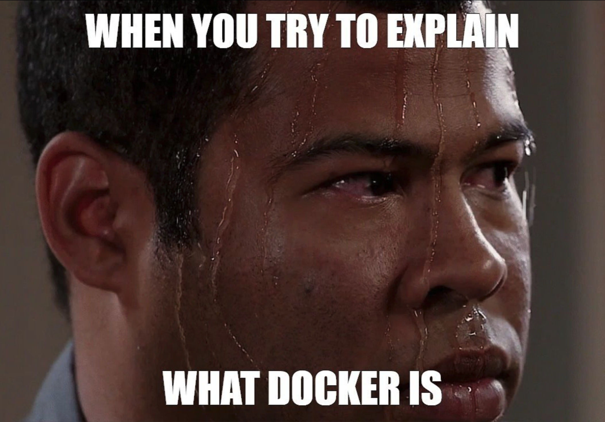
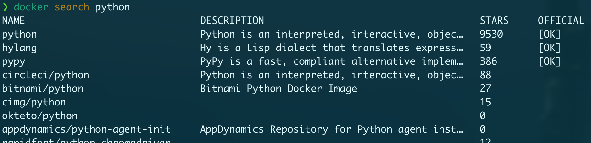

# Docker


---

## What is it?

Docker allows you to containerize your app.

--->

### Containerize you say?

Yes.

The transportation analogy.

--->

#### Before containers


--->

#### After


--->

#### K, but what is it?

An isolated environment for applications.

--->

#### Oh, so, like a VM?

No. But also yes. But no.



--->

#### VMs and containers


Note:
* Virtual Machines are slow and take a lot of time to boot.
* Containers are fast and boots quickly as it uses host operating system and shares the relevant libraries.
* Containers do not waste or block host resources unlike virtual machines.
* Containers have isolated libraries and binaries specific to the application they are running.
* Containers are handled by Containerization engine.
* Docker is one of the containerization platforms which can be used to create and run containers.

Take note of that "Must be Linux" on the host OS. Docker works on Mac and Windows by
running a lightweight VM. Shhh, don't tell anyone.

--->

### Containers vs Images

K, but I've heard of images and containers. Are they the same thing?
<br>
<br>

No.
<br>
<br>

<dl>
<dt>Image</dt>
<dd>A snapshot of everything needed to run a container.</dd>

<dt>Container</dt>
<dd>An running (or previously run) instance of an image.</dt>
</dl>

---

## The Nitty-gritty

Daemons. Layers. Hosts. Registries. Namespaces. Control Groups.

We're not getting into any of that today.

If you want to dive a little deeper on *how it works* [here's a good
starter](https://www.freecodecamp.org/news/a-beginner-friendly-introduction-to-containers-vms-and-docker-79a9e3e119b/)

---

## Why should we use it?

Consistency and Isolation


Note: Think of it like a sandbox. Want to test against multiple versions of python?
Easy. Want to isolate it from system packages? Easy. Want to run it on another machine?
Easy.

---

## How do we use it?

```sh
docker help
```

--->

### Dockerfile

```yaml
# Start with a base image
FROM python:3.8

# Set a directory for the app
WORKDIR /usr/src/app

# Copy all the files to the container
COPY . .

# Install dependencies
RUN poetry install --only main --no-interaction

# Define the port number the container should expose
EXPOSE 5000

# Run the command
CMD ["python", "./app.py"]
```

Note: The Dockerfile is the source code for your docker image. Each command is a layer
in the image. These layers come into play with caching and optimization. When you change
a Dockerfile and rebuild an image, all the layers below your changed layer are rebuilt.

The Dockerfile can get complex. You can copy things from one layer to another and discard
the original layer. What you want in the final image is to be as small as possible.
Images can get rather large.

--->

### Building an image

```sh
docker build -t example .
```

Note:
Here you're telling docker to build an image form the current directory. It will look
for a Dockerfile in the current directory and use that to build everything relative to
your CWD.

You're then tagging the resulting image as `example`. Now if you `docker image ls`
you'll see that the repository is `example` and the tag is `latest`. `latest` is a
standard, and default, tag to indicate the last built version. You can also tag it with
a specific version by having a colon name on the tag. So if I build it with example:name
it will be in the repo example with the tag name. Often this will be a git-hash, or a
version number.

You can give a single build multiple tags. Looking at python you'll see `python:3.12` and
`python:3.12.2`. These point to the same image. You'll also see `bookworm` and `slim-bookworm`
and alpine. These all refer to the base image that was used. `slim` will get you a smaller
image size while sacrificing utilities built into the image.

There are a lot more parameters you can add to the build command. `--build-arg` is a
common one.

--->

### Registries

After you build an image, you can push it to a registry.

[Docker hub](https://hub.docker.com/) is the default.

AWS has ECR. Google has GCR. Github has GHCR.

Note: Think NPM or PyPi but for docker images.

--->

### Getting an pre-built image

`docker search python`



This will list repos, not tags.

Visit the [Python repo on docker hub](https://hub.docker.com/_/python) to see all the tags.

Note: Careful. Who knows what code will run in a docker image if you don't trust it.
Because of that, there are official images.

--->

### Private images

If you want access to private images, you need a login.

```sh
docker login
```

For ECR you can use the AWS CLI:

```sh
aws --profile <profile-name> ecr get-login-password | docker login -u AWS --password-stdin <account-id>.dkr.ecr.us-west-2.amazonaws.com
```

Note:
We often use private images. Either from ECR or GHCR. You need to login to be able to
get access to those. The command for that is `docker login`. With AWS and Okta use the
aws cli client to get the ecr login and pipe that to docker login.

--->

### Running a container

```sh
docker run <image>
```

Note: That will start a new container from the image. Most images have a default `CMD` or
`ENTRYPOINT`. You'll see it defined in the `Dockerfile`. You can override it. But running
the image like this will run that default command.

--->

#### Running a specific command

Give me an interactive busybox shell:

```sh
docker run --it busybox sh
```

Run a command and remove the stopped container when done:

```sh
$ docker run --rm -it busybox echo hello from busybox
hello from busybox
```

Note: That first one will run a busybox container and pop you into the shell. The `--it`
gives you an interactive (tty) shell.

The 2nd one runs the echo command, and the `--rm` param removes the container when done.

--->

#### Mount a volume

Mount the CWD into the container at `/usr/src/app`.

```sh
docker run -v $PWD:/usr/src/app busybox
```

--->

#### Using a network

```sh
docker run --net thenet busybox
```

Note: We won't get much into networking here, but networking is one of the things docker
isolates. The default network is `bridge`. You can create networks and allow containers
to only talk to what you want them to. In this case I'm telling this container to only
connect to my network called `thenet`.

You have to create the network before you can use it using the docker network command.

--->

### Other container commands

Here's just a few of them:

* `stop` - Stops a running container.
* `start` - Starts a stopped container.
* `attach` - Attaches to a running container
* `commit` - Creates a new image from a container’s changes.
* `rm` - Removes one or more containers.
* `rmi` - Removes one or more images.
* `ps` - Lists containers.
* `images` - Lists images.
* `exec` - Runs a command in a running container.
* `help` - Gives you all this info and more.

---

### Running multiple containers

Turns out, running all those commands for many containers can be tiresome.

Enter Fig.

Exit Fig, enter `docker compose`

Note: The community realized that managing all that was a bit of a pain. So a company
created a tool called fig that made it easy. Then docker was like "oh, yeah, that *is* a
good idea" and acquired the company. And now we have docker compose. It's built into
docker desktop.

--->

#### What is compose?

Compose is a tool that makes it easy to run multiple containers at once.

Run your whole app with a simple command:

```sh
docker compose up
```

--->

#### The docker-compose.yaml file

This is the magic that makes it work.

```sh
services:
  api:
    image: python:3.12
    depends_on:
      - db
    volumes:
      - .:/usr/src/app
    ports:
      - 1313:80
    environment:
      - API_KEY=OMGWTFBBQ
    command:
      - sh
      - -c
      - '. /venv/bin/activate && python -m app.__main__'
  db:
    image: postgres:15.0-alpine
    environment:
      - POSTGRES_PASSWORD=${DATABASE_PASSWORD}
      - PGDATA=/var/lib/postgresql/data/pgdata
    volumes:
      - ./dev/pg:/var/lib/postgresql/data
```

Note: Let's step through this

This file defines 2 containers. A python container and a postgres container. The API
container can't start until the postgres container is up because it depends upon it.

It maps port 80 inside the container to port 1313 on the host. If I didn't do that
mapping, you wouldn't be able to access that port from outside the docker network.

It sets an environment variable called `API_KEY` with a default value. Docker compose is
.env native. Meaning it reads the env vars defined here, and if there's a .env file
alongside the docker-compose.yaml file it will layer those values over the top. Note the
difference between the POSTGRES_PASSWORD and the API_KEY. One has a default, whereas the
other expects one to be present in the host environment or a .env file.

We also don't map any ports for the database, so I can't access it from the host.

--->

### Building with compose

Build all the images for your docker-compose.yaml file.

```
docker compose build
```

Note: Often your docker compose file will have a build configuration. This will likely
reference a Dockerfile right next to the docker-compose.yaml file. It may have build
args or other context information. We won't dive further into that configuration now,
but this allows you to not have to pull your images from a registry.

When your compose file has a build configuration, and you haven't previously built the
image, it will automatically build it for you when you start the container. So when
might you want to build an image?

The answer is whenever you change something that might cause the result of the build to
be different. Most often, dependencies. Installed a new python package or NPM
dependency? Build that image.

--->

#### What about when I change files?

Easy peasy.

Note:

A compose file is typically used for dev environments.
Tho it can be used for production. I won't get into `swarm` or `kompose` with a k
here.

As such, it typically mounts your local files into the container so when they change,
the container changes.

It also typically runs a server that will reload or restart when files change.

--->

#### Other settings

`docker-compose.yaml` files can get a lot more complex than that.

See [the compose documentation](https://docs.docker.com/compose/compose-file/) for all
the things you can do.

--->

#### Networking

Networking is one example.

```sh
docker run busybox # <-- uses the default network
```

```sh
docker compose up # <-- *creates* a new default network for this application
```

Note: Compose manages a default network for you. 2 applications that are stood up with
docker-compose can't talk to each other without configuring the network as each one gets
its own default network.

An example of why you might manage your own network is if you want to isolate backend
containers from frontend containers. Perhaps your UI only needs to talk to the API
server, but the API server needs to talk to a database and a cache server.

--->

### Docker DNS

Going back to our compose file (example/docker-compose.yaml):

```sh
services:
  api:
    image: busybox
  db:
    image: busybox
```

Let's see what happens:

```sh
$ docker compose up
[+] Running 3/0
 ✔ Network example_default  Created                                                                                                                                                                                  0.0s
 ✔ Container example-api-1  Created                                                                                                                                                                                  0.0s
 ✔ Container example-db-1   Created                                                                                                                                                                                  0.0s
Attaching to api-1, db-1
api-1 exited with code 0
db-1 exited with code 0
```

Note: So what we happened is that compose created the new default network for us. Note
that it took the parent directory name as the, let's call it, application name. It
created a new default network for the application using that name. Typically that's
gonna be a repo name. Here it's example.

It then created 2 containers by the service name defined in the compose file with a
number. `example-api-1` and `example-db-1`. Because the busybox image doesn't have an
`ENTRYPOINT`, there was nothing to run so the containers exited.

Let's pretend they didn't. Instead of using busybox I used an api server and a db
server. The API server would be able to talk to the db server over the default network
using the hostname defined in the compose file. Because we didn't define a hostname, it
defaults to the service name, which in this case, is `db`

--->

### Detached mode (and viewing my logs)

Don't like wasting your terminals?

Start containers like this:

```sh
docker compose up -d
```

And if you need, view logs:

```sh
docker compose logs -f --tail=100 api
```

Note: That first command is what you're going to want to be using 89% of the time. You
can start and stop containers or restart them. But if you just want something to get
going, that's the command you need.

---

## Q&A

Question, comments, thoughts, ideas, concerns?

---

## References

* https://docker-curriculum.com/
* https://docs.docker.com/trusted-content/official-images/
* https://codewithyury.com/docker-run-vs-cmd-vs-entrypoint/
* https://docs.docker.com/compose/compose-file/
* https://www.freecodecamp.org/news/a-beginner-friendly-introduction-to-containers-vms-and-docker-79a9e3e119b/
* https://www.toptal.com/devops/getting-started-with-docker-simplifying-devops
* https://medium.com/@kmdkhadeer/docker-get-started-9aa7ee662cea
