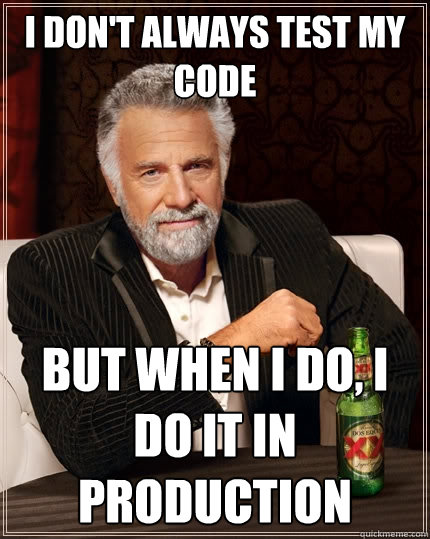

# Feature Flags

---

## What are they?

Just booleans! Right?

Kinda sorta.

Note: At the highest level they turn things on or off.

It's a process/pattern to enable or disable functionality. Can often be used to
remotely make that switch.

They're used to deploy changes without making those changes visiblie to users.

---

## Why should we use them?

Great question!

Thanks for asking!

--->

### So we can turn this


--->

### Into this


Note: Now this is a bit different than what we want. More releases. One per branch. But
you get the idea.

--->

### There are 5 main categories of uses

1. **Release Management** - When can a feature be used
2. **Operational Efficiency** - Work faster with less faults
3. **Experimentation** - A/B testing
4. **Entitlements** - Feature management. I don't love this as a use-case.
5. **Limit risk** - MMTR/Kill Switch, Circuit Breakers, Migrations, Graceful Degradation

Note: 1, 2 and 5 are what we're gonna focus on for now.

By the way, entitlements is a better name than provisions that perhaps we should have
used.

MTTR: Mean Time To Remediate

Graceful Degradation: In situations of high traffic or unexpected load, you can disable
less critical features to maintain the overall system performance.

--->

### Not today's focus

* A/B Testing
* Non-engineering control of flags
* Entitlements

--->

### Topics for another day

* Progressive rollout
* Product controlled launch day

Feature flagging is not necessarily feature management

Note: Where a flag is like a toggle switch, progressive rollout is like a dimmer switch.

--->

### What we ARE talking about

* QA testing
* Kill Switches (MTTR)
* [Trunk Based Development](https://launchdarkly.com/blog/introduction-to-trunk-based-development/)
  * Disabling incremental feature work
  * Testing "disabled" features
  * Testing in production

Note: #### Disabling incremental feature work.

We're talking about making partial changes and merging them to main. Broken features out
in the production.

Who is scared by that?

--->

#### Trunk Based Development

> With feature flags, you can comfortably merge imperfect code with the main branch in
> your version control system today and then pick up where you left off tomorrow. When
> the mainline gets pushed to production, no sweat; users will be unable to interact
> with your flagged code.


> Teams mired in long-lived feature branches, merge conflicts, and aging pull requests
> (PRs) can find relief.

> — [LaunchDarkly](https://launchdarkly.com/use-cases/)


Note: Any of this sound familiar? Aging PRs? Merge conflicts?

<!-- perhaps confortable pull quote from https://semaphoreci.com/blog/feature-flags or save -->
<!-- that for later? -->

--->

### Benefits

* Uncouples release from deploy (continuous delivery)
  * Faster rollout
  * Faster rollback
* Minimizes merge conflicts
* Limits risk
* Enables QA in production
* Progressive rollout (again, not a today topic)
* etc.

Note: Rollout/rollback don't require a deployment.

Let's say josh and I are working on a simlar thing. Same epic. I branch from master. So
does Josh. 3 days later, I finish my work, merge master in and oh no, Josh has changed all
the things. Joooooooooooshhhhhhhhhhhhhhh.

Same scenario. Josh is working on a thing. I need that thing. Some specific shared
class. No problem. Merge that thing. Flag it. Let me use it.

--->


--->

#### Give Joel the tools



--->

### We've used them a bit already

* New Spider rollout
* Python migration is using them
* Front End features disabled

---

## What are they for real tho?

Everything is on a spectrum.

Note: K, so, we know what they are, but what are they tho?

--->

### Natural Progression

1. Hard coded
2. Parameterized
3. Config file
4. Config in DB
5. Distributed config

Note: (Gloss over this and on to the next slides that break them down.)

From least dynamic to most we've got 1-5 here. They fall into 3 categories:

1. Build stage flags (1, 2)
2. Startup flags (2, 3)
3. Runtime flags (3, 4, and 5)

--->

#### Hard coded

```python
def do_thing():
    # return do_new_thing()  # Disabled while under development
    return do_old_thing()
```

Note: Simple. Easy. Not elegant. Not scalable.

--->

#### Parameterized

Python:
```python
def do_thing():

    if strtobool(os.environ.get('NEW_THING_ENABLED', 'false')):
      return do_new_thing()

    return do_old_thing()
```

JS:
```js
function doThing():
    if(process.env.NEW_THING_ENABLED == 'true') {
      return doNewThing()
    }
    return doOldThing()
```

and

```js
NEW_THING_ENABLED=True npm build
```

or

```js
function doThing():
    if(localStorage.getItem('NEW_THING_ENABLED') == 'true') {
      return doNewThing()
    }
    return doOldThing()
```


Note: This was what was used for the spider migration, but via AWS Secret Manager

For the front end this obviously gets built into the compiled code. Or it's a 1-off that
needs to be turned on explicitly by each user.

These are simple to flip, but do require a redeploy.

--->

#### Config file

```python
def do_thing(config):

    if config.new_thing_enabled:
      return do_new_thing()

    return do_old_thing()


class Config:
    new_thing_enabled = False


do_thing(Config())
```

Note: Similar to parameterized, but more dynamic. Config is often committed alongside
code. Env vars not so much.

Again, simple to flip, but usually require a redeploy.

--->

#### Config in DB

Python:
```python
class Flagger
    @property
    def __getattr__(self, name):
        return redis.get(name) == 'True'

    @property
    def __setattr__(self, name, value):
        enabled = value is True
        return redis.set(name, enabled)
```

JS:
```js
class Flagger {
    async getFlag(name) {
        const response = await fetch(`https://example.com/flagger/${name}`);
        return await response.json() === 'true';
    }

    async setFlag(name, value) {
        await fetch(`https://example.com/flagger/${name}`, {
            method: 'POST',
            headers: {
                'Content-Type': 'application/json'
            },
            body: JSON.stringify({ value: value === true ? 'true' : 'false' })
        });
    }
}
```

Note: For the front end we're getting into territory of needing an API or service.

We're also getting into admin UI territory.

This where Libraries usually start coming into play.

--->

#### Distributed config

This is where libraries become required.

```
# Could be SaaS (LaunchDarkly, Optimizely, etc)
# or FOSS (Unleash, Featbit, etc)
# or NIH (Please no...)
# But somebody is gonna have to build something.
```

Launchdarkly Python:
```python
from ldclient import Context


context = Context.builder("context-key-123abc").name("Sandy").build()
flag_value = client.variation("flag-key-123abc", context, False)

if flag_value:
    # application code to show the feature
else:
    # the code to run if the feature is off
```

Optimizely JS (react):
```js
const optimizelySDK = require('@optimizely/optimizely-sdk');
const optimizelyClientInstance = optimizelySDK.createInstance({
  sdkKey: '<Your_SDK_Key>'
});

let flag_value = optimizelyClientInstance.isFeatureEnabled('flag-key-123abc', userId);
```

--->

#### Some Libraries

##### Ruby:
* [Flipper](https://github.com/flippercloud/flipper)

##### Python:
- [Flipper](https://github.com/carta/flipper-client)
- [Gargoyle](https://github.com/YPlan/gargoyle)
- [Gutter](https://github.com/disqus/gutter)

##### JS/React:
* [React Feature Flags](https://github.com/romaindso/react-feature-flags)
* [Flagged](https://github.com/sergiodxa/flagged)

Note:
Ruby: I only listed Flipper for ruby since that's already incorporated. It's been
used for the provisions migration. Flags are in place, but haven't been turned on
yet. But that's the only extant use.

Python: All the most popular I came across reccomendations for seem to be rather dated.

JS: I don't recall where these couple were reccomended.

If we need to adopt self-managed library, let's do some further research. But I think
we'd probalby be better off adopting a sass or foss approach. Preferable OpenFeature.

--->

#### OpenFeature

[OpenFeature](https://openfeature.dev) bridges the gap between libs and platforms

```js
import { OpenFeature } from '@openfeature/js-sdk';

const client = OpenFeature.getClient();
const showWelcomeMessage = await client.getBooleanValue("welcome-message", false);

if(showWelcomeMessage){
  console.log("Hello developer. Welcome to the console.")
}
```

Note: It's a very recent (as of this writing) CNCF standard to avoid vendor lock-in.

JS, ruby, python libraries exist. Python is not yet considered stable.

--->

#### Platforms

##### Paid (SaaS)

- [LaunchDarkly](https://launchdarkly.com/)
- [Optimizely](https://www.optimizely.com/)
- [Split](https://www.split.io/)
- [Cloudbees Rollout](https://www.cloudbees.com/capabilities/feature-management)

##### Free as in puppies (FOSS)

- [FeatBit](https://github.com/FeatBit/FeatBit)
- [Unleash](https://github.com/Unleash/unleash)
- [Flagsmith](https://github.com/Flagsmith/flagsmith)
- [PostHot](https://github.com/PostHog/posthog)
- [GrowthBook](https://github.com/growthbook/growthbook)
- [Flipt](https://github.com/flipt-io/flipt)

Note: Any given service will have their own SDK, or use OpenFeature

Most FOSS also have a paid cloud hosting service.

---

## Awesome! A panacea!

No.

Note: Like everything, there are downsides.

--->

### Some Downsides

* Technical debt (Flag Debt)
* Management overhead
* Debugging can be harder
* Security

Note:

* Flag Debt: Where your codebase is littered with flags, and you don't know the state of
    them
* Management overhead:
    - Coordination and Communication: Managing flags across different teams or
      departments can be tricky. Clear communication is essential to avoid
      misunderstandings and ensure everyone is aware of the state of various flags.
* Debugging:  are you sure which flags were on to produce the error
* Security: Depending on the method, determined customers could identify the flag and
    flip it on for themselves.

What else you got?

--->

### Flag Hygiene

* Invest time in good naming conventions and stick to it
* Use them with measure
* Keep the lifespan short (weeks)
* Track and audit flag usage
  * Have a way to view the state of all your flags
* Always be positive
* Log flag states
* Communicate and collaborate

Finally,

* Never, ever, ever, repurpose a flag.

Note: Gloss over this slide. Each bullet gets its own slide.

--->

#### Invest in good Naming Conventions

Invest time in good naming conventions and stick to it.

- Choose descriptive names for your flags.
    - New-Feature-2 is NOT a good name.
- Up to us to decide. Some I've seen include:
    * Team name prefix/postfix? fe_foo be_bar
    * Jira ticket number included
    * Casing (camel/snake/kebab, etc.)
    * Prefix/postfix for common uses
        + (temp_baz, rollout_bar, baz_expiriment)

We should define and preferably lint for whatever we choose.

--->

#### Use flags with measure

- Don’t add a feature flag automatically to everything.
- Keep them small and focused


Note:
- Don’t add a feature flag automatically to everything. Every bug fix probably doesn't deserve a flag. Some certainly do. Be smart.
- Keep them small and focused
    - Instead of using one flag for multiple features, use a separate flag for each
      feature. This makes it easier to manage and test each feature individually. We
      should be rolling out features individually anyway, so this just makes sense.
      See don't repurpose flags.

--->

#### Keep the lifespan short (days/weeks)


Note:
- Have a clear plan in place for when to remove flags.
- Audits are a boring but effective way of managing this
- Time bomb tests are a surprisingly fun (pun intended) and intense way to do this

--->

#### Clean up at EOL


--->

#### Track and audit flag usage

What this looks like is up to the team.

A centralized system (SaaS/FOSS) helps here.

Note:
- Metadata can be incredibly valuable
    * Descriptions
    * Create date
    * Expected EOL date
    * Creator
    * Responsible party/team
    * Jira ticket
- As can statistics (which require a robust system)
    * Last evaluation time
    * Evaluation frequency
    * Most common evaluation value
    * How often it differs from baseline
    * Last time it differed
    * Who/when last toggled it
* Have a way to view the state of all your flags
    - Preferably use a FFMT

--->

#### Always be Positive

Don't use negative values to enable a flag. It can lead to confusion.


Note: Anybody catch the irony of this slide?

--->

#### Remember to log infromation about flags


Note:
For example debug logs, or super important, the sentry context.

--->

#### Stop, Collaborate and Listen


Note:

Everyone should know what the flags are, what they're used for, and if they can be
removed.

This will help prevent confusion and ensure that the flags are being used effectively.

--->

#### Don't repurpose flags


Note:
Reusing flags can be costly. Ever hear about Knight Capital Group?

> When the NYSE opened on the morning of August 1, 2012 Knight Capital Group was the
> largest trader in US equities and a major market maker in the NYSE and NASDAQ.
> 45 minutes later they were bankrupt.

Long story short:
* They were rushed to get a new feature out
* didn't have automated deployments
* repurposed a feature flag
* old code wasn't removed

When they deployed the new feature:
* only 7 of 8 servers got the new code
* The flag was turned on, and the old code caused unlimited purchasing of stocks
* Ops said "roll back the code!!!1!" and now 8/8 servers were buying unlimited stocks
* By the time they got it fixed, KCG had driven up the price of 150 stocks and placed
  almost 7 billion dollars worth of orders without the capital to back it up. Goldman
  Sachs stepped into to cover as they back it up, but at a cost to KCG of $440M.

It's an interesting story. Go read it.

There's a lot of other lessons to learn here. But one of them is don't reprupose flags.

---

## How do I use them?

Great question.

It depends.

--->

### Just throw an `if(flag)` aound some code, right?

Hold on to them horses a bit.

A couple of things to help keep the flag debt down and our code clean.

* De-couple your decision points
* Inversion of decision
* Avoiding conditionals

--->

#### For example

Functional. Easy.
```python
def search(**kwargs):
    if flag_sdk.get("NEXT_GEN_TOOLING"):
        # New implmementation
    else:
        # Old implementation
```

But what happens when our code is littered with that if statement?

Note: This looks reasonable, but it's brittle.

Littering flags is still littering. A little abstraction can go a long way.

Why should the search know about the next gen feature set? What if we want to turn on
some parts without others? What if decide to use progressive rollout? Also magic
strings.

Flag scope.

--->

#### A Conscious Uncoupling

* De-couple your decision points from your decision logic

```python
# .../config.py
class FlagConfig:
  should_use_ai_search = flag_sdk.get("NEXT_GEN_TOOLING")
```

```python
# .../search.py
from ...config import FlagConfig

def search(**kwargs):
    if FlagConfig.should_use_ai_search:
        # New implmementation
    else:
        # Old implementation
```

Note: Now if we want to change something about the decision, there's a single place to
do it rather than littered throughout the codebase.

--->

#### Inversion of Decision


```python
# .../search.py

def search(config, **kwargs):
    if config.should_use_ai_search:
        # New implmementation
    else:
        # Old implementation
```

Note: Previously, the search was responsible for asking about it. Why should it know
anything about it? Inject that shiz. Testing made easy.

--->

#### Avoid conditionals

```python
# .../search/standard.py
def search(**kwargs):
    # New implmementation
```

```python
# .../search/ai.py
def search(**kwargs):
    # Old implementation
```

```python
# .../search/__init__.py
from .standard import search as standardSearch
from .ai import search as aiSearch


def searchFactory(config):
  if config.should_use_ai_search:
    return aiSearch
  return standardSearch
```

```python
# .../logic.py
from ...search import searchFactory
from ...config import FlagConfig

result = searchFactory(FlagConfig).search(**kwargs)
```

Note: Now we have a "Feature-Aware-Factory". Looks more complicated, but is clean. None
of our implemented logic has conditionals.

This is a bit of a contrived example, and perhaps I should have just "borrowed" Marty's
examples directly, but there you have it.

--->

### So you're saying I always need a factory?

No. Be smart.

Note: Simple short-lived flags, something we're after here, may be fine with a simple
if/flag.

--->

### Let's talk about it.

- What keeps us from using them now?
- What do we not know?
- What level (1-5) are we using/should be using?
- Do we need to find a FFMT?

> For this to work, we must be comfortable with committing partial features into the
> main trunk. Here is where feature flags shine. Feature flags let us share new code to
> the team while preventing users from viewing/using incomplete features.

---

## Q&A

Question, comments, thoughts, ideas, concerns?

Note: I know I have a lot of room to improve on making use of feature flags. I feel like
it's one of those things that doesn't fully click until dive into it. I mean, it makes
sense, but change is hard man, get off my back.

All the data says if we do this our lives will be better. Let's make our lives better.

---

## Final thoughts

As is always the case with Marty, I highly recommend you make 40 minutes for yourself and read this:

https://martinfowler.com/articles/feature-toggles.html


And perhaps Listen to these talks, cause they'll make the case better than me, no doubt.
* https://www.datadoghq.com/videos/how-we-made-deploys-less-scary/
* https://www.datadoghq.com/videos/how-small-changes-can-make-huge-waves/

Note:
Disclaimer, I haven't yet fully listened to the talks, but I read some of the transcript
and the seem great.

In summary: Feature flagging, yes, adds complexity, but brings flexibility. We can ship
more frequently, avoid merge hell, test on production and release features at just the
right time. Feature flags have become SOP for trunk-based development and continuous
delivery.

---

## References

* [Martin Fowler on Feature Toggles][fowler-feature-toggles]
* [FeatureFlags.io][ff-io]
* [SemaphoreCI - Feature Flags: A Gentle Introduction][semaphore-feature-flags]
* [Coding With Feature Flags How-to Guide and Best Practices][coding-ff-howto]
* [TSH - Feature Flags Best Practices][tsh-ff-best-practices]
* [LaunchDarkly][ld]: [What are Feature Flags?][ld-what-are-feature-flags],
  [Feature Management Platform: Build or Buy?][ld-build-or-buy], and
  [Trunk Based Development][ld-trunk-based-dev]
* Knight Capital Group Saga
  * https://www.henricodolfing.com/2019/06/project-failure-case-study-knight-capital.html
  * https://dougseven.com/2014/04/17/knightmare-a-devops-cautionary-tale/

Plus any others linked throughout.

[fowler-feature-toggles]: https://martinfowler.com/articles/feature-toggles.html
[ff-io]: https://featureflags.io/resources/
[ld]: https://launchdarkly.com
[ld-build-or-buy]: https://launchdarkly.com/blog/feature-management-platform-build-or-buy/
[ld-trunk-based-dev]: https://launchdarkly.com/blog/introduction-to-trunk-based-development/
[ld-what-are-feature-flags]: https://launchdarkly.com/blog/what-are-feature-flags/
[semaphore-feature-flags]: https://semaphoreci.com/blog/feature-flags
[coding-ff-howto]: https://thysniu.medium.com/coding-with-feature-flags-how-to-guide-and-best-practices-3f9637f51265
[tsh-ff-best-practices]: https://tsh.io/blog/feature-flags-best-practices/
