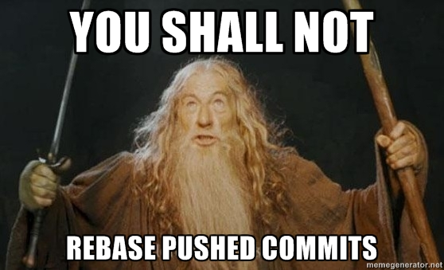
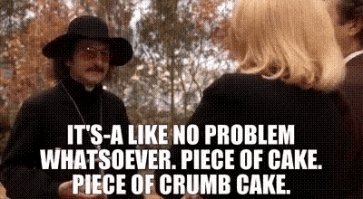

# I ain't afraid of no Git!


---

# First off...
+ I have used CVS, SVN, and git
+ git really whips the llama's ass
  * No, wait, that's winamp. But still...
+ I am by no means a git expert

---

## Yeah. Yeah. What are we gonna cover?
* What Git IS
* How Git works (the internals)
* The Basics
* Branching
* Branching Models
* Your Questions
* Customizing Git
* Git Tools
<!-- TODO: update to match top levels-->

---

# What is git?

(If you're asking this question, we have a problem.)

--->

# It's a VCS...

--->

# Cool!
### But, uh...

--->

## What is a VCS for?
 * Traveling back in time
    + Revert files back to a previous state
    + Revert the entire project back to a previous state
    + Compare changes over time
    + Who introduced an issue and when
 * Sharing
 * Collaborating
 * Paralelizing your work
    + Solving multiple issues separately
    + Make a quick fix in the midst of developing a feature

--->

# Awesome, I want one!
##### Is git the only option?
##### \*cough\* No... \*cough\*
##### (yes)

--->

## Frequently making a backup
* The caveman solution
* Muggles still use this everyday
    + Designers
    + Managers
    + Lawyers
    + Doctors

* Good
    + Pretty straightforward
* Bad
    + ???

--->

## Suddenly... CHAOS!


--->

## Local VCS
* Good
    + ???
* Bad
    + Hard to manage over time
    + Hard to collaborate
    + Single point of failure

--->

## Centralized VCS
* CVS, Subversion, etc.
* Standard solution for many years and still used by many

* Good
    + Easier to collaborate
    + Not too hard to understand
    + Easier to administer (if you're a devop)
* Bad
    + Single point of failure
    + Hard to work without access to the server

--->

## Distributed VCS
* git, Mercurial, etc.
* Clients fully mirror the repository
* No single point of failure
* Best for collaboration - multiple remotes

--->

# So... git!

--->

## What is it?

--->

### It's Stupid

    man git

> git - the stupid content tracker

--->

### It Stores Snapshots

It's not a change tracker, it's a content tracker.

Other VCSs store lists of changes. Git stores complete snapshots.

More on this in a minute.

--->

### A Short History of Git
Linus, man. That guy.

--->

Basically, Linux devs were using BitKeeper which was proprietary.

--->

The owner made some stupid moves, pissed off the community, withdrew the free
lisences, so Linus said:

> These are the 3 rules for what we need

Nothing on the market matched.

--->

So Linus took 4 days and wrote it. Started on April 3rd 2005. Was self-hosting
on April 7. On June 16th, git was used for Linux.

--->

A month later Linus turned it over to the current maintainer.

--->

### Where did the name come from?

It's named after Linus. Cause he considers himself a git.

<dl style="text-align: left">
  <dt>git:</dt>
  <dd>an unpleasant or contemptible person.</dd>
</dl>

--->

## git is designed for
* Speed - simple design
* Non-linear development (thousands os parallel branches)
* Fully distributed
* Scale - able to handle large projects like the Linux kernel efficiently

--->

## git is different
* While other VCSs represent commits as file based changes, git takes snapshots of the files
* git stores data as snapshots of the project over time
* Nearly every operation is local
* Local history
* Database is replicated when cloning
* You can commit without network connection
* Integrity is built-in

--->

# If you don't use git, you better have a good reason not to

---

# Let's git!

--->

### First-Time Git Setup

We'll talk about that in Configuration

---

# How does git work (the internals)

--->

## How does git store one commit?

<!-- TODO: make hashes visible on background. Also, svg? -->

--->

## How does git store many commits?

<!-- TODO: make hashes visible on background. Also, svg? -->

--->

## A branch is... just a pointer

<!-- TODO: make hashes visible on background. Also, svg? -->

## Snapshots FTW!

--->

## Multiple branches = Multiple pointers


--->

## How do I know which branch I'm on?


## HEAD

--->

## Switching branches


    $ git checkout testing

--->

## A commit consists of

+ Message
+ Author(s)
+ Commiter
+ Date
+ Pointer to tree (snapshot)
+ Pointer to previous commits

--->

## What are branches?
+ A branch in Git is simply a lightweight movable pointer to one of these commits.
+ When you commit, the branch moves forward, pointing to the new commit.
+ A branch in git is actuality a simple file that contains the 40 character SHA–1 checksum of the commit it points to

--->

## Branching is inexpensive
+ Creating a new branch is just creating another pointer!
+ Creating a new branch is as quick and simple as writing 41 bytes to a file (40 characters and a newline).
+ Branching is a LOCAL operation, no server communication is needed
+ Switching branches changes the files in the working directory
+ A special pointer called HEAD always points to the current branch

--->

If you want to understand the internals deeper than this go read the [Git
Internals](https://git-scm.com/book/en/v2/Git-Internals-Plumbing-and-Porcelain)
section of Pro Git book.

---

# Basics

We don't have to cover this stuff.
Cause you know it, right?

--->

## Using git


--->

### Create a new repo
    $ git init
<br>

### Clone an existing repo
    $ git clone <repo>

--->

### Committing files

--->

#### Possible status of files
+ Untracked - changes are not recorded by git
+ Tracked
    + unmodified - no changes since last snapshot
    + modified - modified since last snapshot
    + staged - a modified snapshot which is ready for commit

--->


--->

#### git add is a multipurpose command
+ git add to track new files
+ git add to stage files
+ git add to mark conflicts as resolved

--->

#### What changes have I made?
    $ git diff          // changes still unstaged
    $ git diff --cached // changes staged to commit

--->

#### I want to commit!
    $ git commit -m "Learning git is fun!"
<br>
This will commit everything which is staged.

<br>

    $ git commit

This will open your EDITOR to properly write a commit message.

--->

## Robert Baratheon commits


--->

## Robert Baratheon commits
    $ git commit -a -m "fix stuff"
<br>
This will stage and commit the files in a single operation

(boo on you, if you do)

--->

## "I commited but forgot to..."
    $ git commit --ammend

--->

## Removing files
    $ git rm file.txt          // removes from repo & working directory
    $ git rm --cached file.txt // removes from repo

--->

## Moving  and renaming files
    $ git mv file_from file_to

<br>

## Is just a short hand for
    $ mv README.txt README
    $ git rm README.txt
    $ git add README

--->

## Ignoring files
    $ vim .gitignore
IDE files, local settings, etc...

--->

## Removing a file from the staging area
    $ git reset <filename>

--->

## Undo file changes
    $ git checkout <filename>

--->

## Branches

```
git branch
git checkout
git branch
```

--->

### Create a branch
    $ git branch <branch_name>
### Delete a branch
    $ git branch -d <branch_name>

--->

### Move to another branch
    $ git checkout <branch_name>
### Create a branch and switch to it
    $ git checkout -b <branch_name>

--->

### List branches
    $ git branch

--->

## Remotes
### List remotes
    $ git remote -v
### Add a remote
    $ git remote add <name> <url>

--->

## Fetch changes from remote
    $ git fetch <remote>
<br>

## Pruning local branches
    $ git fetch -p <remote>
<br>

## Fetch + Merge with branch
    $ git pull <remote> <branch>
<br>

## Pushing
    $ git push <origin> <branch>

---

# Regarding commit messages

--->

## Commit Messages...
+ Are in the present tense and imperative mood
+ Start with a capitalized letter
+ Have a subject that does not exceed 50 chars
+ Have a thorough message body that explains in detail what was changed and
  why. This message is linewrapped at 72 chars.


These are standard git rules.
If you have a good editor <small>*cough*VIM*cough*</small> it will yell at you when you don't
follow them.

--->

## A good commit message is broken up into 3 parts:

1. The What
2. The Why
3. The Where

--->

### 1. The What

  * This is your first line.
  * It completes the sentence, "This change in this commit will..."
  * It does not end in a period
  * It is no longer than 50 characters

--->

### 2. The Why:

  * This makes up most of the body.
  * linewrapped at 72 chars.
  * Why specifically and technically is this change being made?
  * If referencing details for which the files inside this commit provide
    context, also reference those files here as that information will be
    muddied in a squashed message.

--->

### 3. The Where:

  i.e. Where can I find more information about this task?

  * Why the Jira ticket, of course! i.e. List all applicable Jira ticket.
    * Or github issue. Or whatever ticketing system.
  * You may list more than one ticket
  * Each ticket on its own line.

--->

## Viewing the Commit History
A huge number and variety of options to the git log command:

    git help log

--->

### Basic history

    git log

--->

### See the patch of a specific commit

    git log -p -1 <HASH>

--->

### See just the files changes

    git log --stat

--->

### One line

    git log --pretty=oneline
or better

    git log --graph --pretty=oneline --abbrev-commit --decorate

---

# Branching

--->

## Basic Branching and Merging

Create a new branch

    $ git checkout <new_branch>

Merge a local branch

    $ git merge <branch>

Merge a remote branch

    $ git merge <remote> <branch>

--->

## Merge commits
<!-- TODO: local image -->


C6 here is a merge commit.

--->

## Conflicts
    <<<<<<< HEAD:index.html
    <div id="footer">contact : email.support@github.com</div>
    =======
    <div id="footer">
     please contact us at support@github.com
    </div>
    >>>>>>> iss53:index.html

--->

## Mergetool

    git mergetool

<!-- TODO: local image -->


--->


### Mergetools for mac

* vimdiff
* FileMerge (bundled with xcode)
* [Kaleidoscope](https://www.kaleidoscopeapp.com)
* [P4Merge](https://www.perforce.com/product/components/perforce-visual-merge-and-diff-tools)

--->

## Branch Management

List local branches

    $ git branch

List all branches (including "remote")

    $ git branch -a

List merged branches

    $ git branch --merged

List unmerged branches

    $ git branch --no-merged

--->

## Remote Branches

origin is special
(but it isn't, really. It's just a default name)

<!-- TODO: local image -->


--->

### Gotta push your branches

Everything is local until you push.

--->

### Wanna track your branches?

* automatically set up when checking out a remote branch
* git pull is automatic
* not automatic when creating a local branch

--->

### Deleting Remote Branches

    $ git push origin --delete mybranch
    To https://github.com/example/mybranch
    - [deleted]         example

--->

## Rebasing

We have an experiment branch

<!-- TODO: local image -->


--->

### Merging

If we merge, rather than rebase, we get this:
<!-- TODO: local image -->


--->

### Rebasing

When we rebase, we get this:
<!-- TODO: local image -->


--->

Now we can fast forward

    $ git checkout master
    $ git merge --ff-only experiment

<!-- TODO: local image -->


--->

#### Lets get interesting

Let's say we had:
<!-- TODO: local image -->


And we only want the client commits. How?

--->

#### Rebase!

    $ git rebase --onto master server client

This basically says
> Take the client branch, figure out the patches since it
> diverged from the server branch, and replay these patches in the client
> branch as if it was based directly off the master branch instead.

--->

Now we can fast-forward merge (open a PR).
<!-- TODO: local image -->


--->

### The golden rule of rebasing

Never rebase a shared branch.
Rebase **ONTO** a shared branch.



[read more](https://www.atlassian.com/git/tutorials/merging-vs-rebasing#the-golden-rule-of-rebasing)

--->

### Patches

Did you know&trade; A git repo can be managed via email?

    git format-patch HEAD^

Did you know&trade; A git diff is a patch.

    git diff origin/master > uncommitted-changes.patch
    git checkout .
    git apply uncommitted-changes.patch

---

# Some examples of branching models

--->

## Git flow

[A successful git branching model](https://nvie.com/posts/a-successful-git-branching-model/)

Great for versioned releases, or supporting multiple versions.
Not great for continuous deployment.


--->

## Github Flow

[Github Flow](https://guides.github.com/introduction/flow/)

Fits within a portion of Git Flow (crossing swimlanes).

Great for continuous deployment when based off master.


--->

## Feature branches

Feature branches collect all work on a feature before it is merged.

Rather than small incremental changes, long-running feature branches can
result in large PRs and hefty changes.

---

# Your Challenges

Let's go over the specific things you asked about.

* Chaining PRs
* I shouldn't have rebased?
* I need those commits from that branch...

--->

## Chaining PRs

Stacked PRs can be annoying. So we avoid them and do 1 of 3 things:

1. Huge PRs. Can still be reviewed by commit.
1. Break PRs up by files touched so there's no overlap.
1. Wait. And wait. And wait.

--->

### Instead

1. Create a WIP Pull Request
1. Create stacked PRs from WIP branch.
    Using all the fun tools git has available to us.
1. Merge Up, Squash Down

[Reference](https://unhashable.com/stacked-pull-requests-keeping-github-diffs-small/)

--->

## I shouldn't have rebased?

A problem I ran into a while ago was that I got mixed up and thought that I
should rebase my branch with master rather than merge master into my branch.
Suddenly I had to approve every change my branch had made in the 30+ commits it
had. It was really messy so I ended up making a new branch and copied my code
changes to the new branch. So I would like to know:

1. the proper usage and improper usage of rebasing and
2. how to gracefully recover from bad rebasing 😜

--->

Rebasing is for keeping git history clean.

Plucking commits **_one by one_** and placing them onto another branch.

This is why you found yourself in merge conflict hell.

--->

### When to rebase

**When do you want to do this?**

When you care about how the history looks.

**When do you merge instead?**

When you don't care about history (you should) or you want a group of commits
to stand apart. Merge commits should be meaningful events.

Remember the golden rule of rebasing.

ALso, `git rerere`

--->

### How do you recover?

    git rebase --abort

--->

## I need those commits from that branch...

So you made some commits.

After some other commits.

And you need just those.



--->

### So manual. So gross. So common.

Manually applying changes. Copy paste.

If you're comfortable, echo a diff to a file,
then apply, checkout the changes you don't want and commit.

VERY gross, but affective.

(don't do this)

--->

### So good. So delicious. Cherry pick.

    git checkout master
    git log --graph --pretty=oneline --abbrev-commit bar


    git cherry-pick cf1d77e..bar  # 💰💰💰


---

# Being a good member of git society

* Follow golden rule of rebasing
* Don't commit whitespace errors (git diff --check)
* Make each commit a logically separate changeset.
  * Use the staging area to stage the logical changes (even patch adding)
  * Rebase if needed.
* Craft good commit messages

--->

## Maintaining over time

Tag whenever a release version is created

    git tag -a v1.2.3

Look! Semver compat alpha version if you tag with semver:

    $ git describe master
    v1.2.3-20-g8c5b85c

20 commits since v1.2.3 with a hash of g8c5b85c

--->

## Changelogs

As long as you have well-written and complete commit messages,
it can be as easy as

    git shortlog --no-merges master --not v1.2.3

Gives you all commits since v1.2.3 grouped by author

---

# Git tools

--->

## Revision Selection

For reference:


--->

### Carrots are delicious

    HEAD^ # The commit before head
    HEAD^7 # The commit 7 before head

--->

### Double Dot

    $ git log master..experiment
    D
    C

Will show the log for all commits on `experiment` since it diverged from master

    $ git log experiment..master
    F
    E

Likewise shows commits on master since they diverged


--->

### Triple Dot

    $ git log master...experiment
    F
    E
    D
    C

Will show all commits on branch `master` OR `experiment`, but not both.


--->

### Oops, I committed a certificate on my branch

    git filter-branch --tree-filter 'rm -f passwords.txt' HEAD

And then:

  * Stop staging all, or committing all:
    - `git add -a`, `git add .` and `git commit -a`
  * Instead, stage interactively:
    - `git add -p`
    - `git add --interactive`
  * Verify before committing:
    - `git diff --staged`

<br>
If you've pushed your history to your remote, well...
[There's more to it](https://help.github.com/en/github/authenticating-to-github/removing-sensitive-data-from-a-repository)

--->

### Rerere

git re(use )re(corded )re(solution)

    git config --global rerere.enabled true

Ever had to resolve the same conflict more than once? Never again!

<!-- Note: This will store the diff hunks alongside the resolution and
automatically apply them the next time that diff is found. -->

--->

## Other things you should look into

I ran out of time to prepare today:

* [interactive staging](https://git-scm.com/book/en/v2/Git-Tools-Interactive-Staging)
* [stashing](https://git-scm.com/book/en/v2/Git-Tools-Stashing-and-Cleaning)
* [signing](https://git-scm.com/book/en/v2/Git-Tools-Signing-Your-Work)
* [searching](https://git-scm.com/book/en/v2/Git-Tools-Searching) (git grep FTW)
* [rewriting history](https://git-scm.com/book/en/v2/Git-Tools-Rewriting-History)
* [debugging](https://git-scm.com/book/en/v2/Git-Tools-Debugging-with-Git)
  * `git blame`
  * `git bisect`
* [submodules](https://git-scm.com/book/en/v2/Git-Tools-Submodules)
* [advance merging](https://git-scm.com/book/en/v2/Git-Tools-Advanced-Merging) <!-- reordering history meow/omg/wtf/bbq/woof -->
* [understanding reset](https://git-scm.com/book/en/v2/Git-Tools-Reset-Demystified)


<!--
# Let's reset
TODO: finish
https://git-scm.com/book/en/v2/Git-Tools-Reset-Demystified

---
-->

---

# Customizing Git

--->

## Where are my settings?

* System setting       : `/etc/gitconfig`
* Global user settings : `~/.gitconfig`
* Repository settings  : `.git/config`
* Windows: `C:\Documents and Settings\$USER\.gitconfig`

--->

### Check current settings

    git config --list # show all config values, last ones have priority
    git config user.name # show config value

--->

## What should I configure?

--->

### Identity

    git config --global user.name "John Doe"
    git config --global user.email johndoe@example.com

--->

### Editor

    git config --global core.editor vim

This is the only correct setting. All others are invalid. ☭

--->

### Merge tool

Don't change this if you're not sure

    gif config --global merge.tool vimdiff

--->

### Colors

Git colors output by default, but not *super* helpfully. Fix that:

    git config --global color.grep = auto
    git config --global color.branch = auto
    git config --global color.diff = auto
    git config --global color.interactive = auto
    git config --global color.status = auto
    git config --global color.ui = auto

    git config --global branch.current = green bold
    git config --global branch.local = green
    git config --global branch.remote = red bold

    git config --global diff.meta = yellow bold
    git config --global diff.frag = magenta bold
    git config --global diff.old = red bold

    git config --global grep.filename = yellow bold
    git config --global grep.linenumber = green

--->

### Commit Message Template

    git config --global commit.template ~/.gitmessage.txt

This can help you remember how to commit good messsages.

You can set it to help you remember our commit guidelines
~/.gitmessage.txt:

    This commit will... (be less than 50 chars)

    I'm making this commit because (specifically and technically) lorem
    ipsum dolor sit amet. Pork belly elit ipsum ut eu aliquip buffalo.
    Brisket dolore veniam fatback picanha. Short ribs in voluptate, ex
    salami sirloin prosciutto. Mollit cow pastrami occaecat. Tenderloin pork
    loin tail laborum do pig.

    CORE-123

--->

### Autocorrect

    $ git config --global help.autocorrect 1

<!-- Note: The 1 is an int that refers to 10ths of a second. 30 would mean wait 3 seconds. -->
Now that you've set that:

    $ alias gi=git
    $ gi tcheckout master
    WARNING: You called a Git command named 'tcheckout', which does not exist.
    Continuing in 0.1 seconds, assuming that you meant 'checkout'.
    Your branch is behind 'origin/master' by 3 commits, and can be fast-forwarded.

--->

### LF > CRLF

    $ git config --global core.autocrlf input

--->

## Bash Completion

Bash completion is off by default, even though it ships with it.

[Turn it on](https://git-scm.com/book/en/v2/Appendix-A%3A-Git-in-Other-Environments-Git-in-Bash)

Or use [ZSH](https://www.zsh.org/). And [Oh-My-ZSH](https://ohmyz.sh). And enable the git plugin.
But that's a topic for another day.

--->

## Git Hooks

Git allows us to run scripts before/after things happen.
A common usecase for that is linting before committing code.

I have scripts that can lint code, run tests, grep for keywords I don't want
committed, etc.

Git hooks are not committed, and must be added locally when a repo is cloned.

--->

## Templates

Global templates are a great way to setup hooks

    git config --global init.templatedir = ~/.gittemplate

~/.gittemplate is a collection of files that will be placed in the `.git`
directory when a repo is cloned.

--->

## Just some of my config

    [alias]
      # nice log output
      lg = log --graph --pretty=oneline --abbrev-commit --decorate

      # Used by other aliases
      remoterepo = "!f() { \
          repo=$(git remote -v | grep -m 1 \"(push)\" | sed -e 's/.*github.com:\\(.*\\) .*/\\1/g' | sed -e 's/\\.git//g' ); \
          echo $repo; \
      }; f"
      # Open Repo in github
      hub = "!f() { repo=$(git remoterepo); \
          url=https://github.com/$repo; echo $url; echo ''; \
          open $url > /dev/null 2>&1; \
      }; f"
      # Create a PR on github
      pr = "!f() { branch=$(git rev-parse --abbrev-ref HEAD); \
          git pull && git push && git prurl && echo '' && \
          git co master && git br -d $branch; \
      }; f"

      # Open CircleCI: opens url https://circleci.com/gh/<ORG>/<REPO>
      cci = "!f() { repo=$(git remoterepo); \
          url=https://circleci.com/gh/$repo; echo $url; echo ''; \
          open $url > /dev/null 2>&1; \
      }; f"

      # Replace a file with the version at a specific hash
      overwrite = "!f() { \
          commit=0dd165a; \
          for file in $@; do \
              git show $commit:$file > $file; \
              git add $file; \
          done; \
      }; f"
      ow=overwrite

      # Edit in vim all modified and untracked files
      vi = "!f() { git status --porcelain | sed -n 's/^\\( M\\|??\\) //p' | tr \"\\n\" ' ' | xargs bash -c 'vim \"$@\" < /dev/tty' ignoreme; }; f"

      # Commit with branch name appended
      cim = "!f() { branch=$(git rev-parse --abbrev-ref HEAD) && git commit -m \"$1 -- $branch\"; }; f"

      # create branch on remote
      cob = "!f() { git pull && git co -b $1 && branch=$(git rev-parse --abbrev-ref HEAD) && git push --set-upstream origin $branch; }; f"

      # forget this --set-upstream business.
      track = "!f(){ branch=$(git rev-parse --abbrev-ref HEAD); cmd=\"git branch --set-upstream $branch ${1:-origin}/${2:-$branch}\"; $cmd; }; f"

      # Grep like ack
      ack = grep --break --heading --line-number --color=always -I
      ick = grep --break --heading --line-number --color=always -I --ignore-case

---

# Conclusions

--->

+ Learn the tools git provides
+ Use the CLI (you'll learn git better)
+ Stage files interactively (patch add)
+ Rebase to keep a clean history
+ Craft your commits - it will help you
  * Don't just "save your work"
+ Branch and Merge are friends - __don't be afraid of them!__
+ Git is awesome

--->

## Need help?
    git help <verb>
    git <verb> --help
    man git-<verb>

Example:

    git help config

* Free book! - [ProGit](http://git-scm.com/book "ProGit")
* Ask me!

--->

## References

+ https://git-scm.com/book/en/v2
+ https://www.atlassian.com/git/tutorials/merging-vs-rebasing#the-golden-rule-of-rebasing
+ https://en.wikipedia.org/wiki/BitKeeper
+ https://en.wikipedia.org/wiki/Git
+ https://www.git-tower.com/blog/diff-tools-mac/
+ https://help.github.com/en/github/authenticating-to-github/removing-sensitive-data-from-a-repository
+ This slide deck shamelessly modified from [João Duarte](http://jdduarte.com/git-training/#/11)

<!---
  * [Getting Started](#getting-started) (what is git)
  * [Git Basics](#git-basics) (basics)
* [Git Branching](#git-branching) (branching)
* [Being a good member of git society](#being-a-good-member-of-git-society) (NEW)
* [Git Tools](#git-tools) (tools)
* [Let's reset](#lets-reset) (NEW)
* [Customizing Git](#customizing-git) (Customizing)
* [Attributions](#attributions) (Conclustions)
-->
