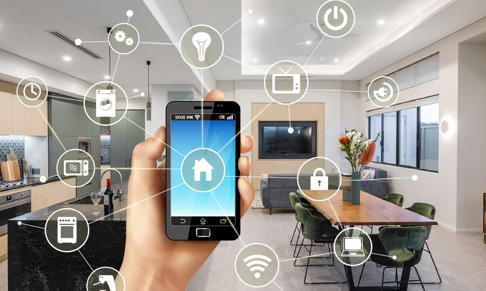

# Home Automation

---

## Why home automation?

* Laziness (convenience)
* Security
* Cost Saving
* Remote Control
* Fun!

--->

### Integrated HA
Expensive and proprietary

Been around a long time

Ever seen the movie Antitrust?
 
 

--->

### Piecemeal HA

Less expensive and purpose fit

You can end up with tons of different control systems

Currently exploding

---

## IOT - The protocols

--->

### Z-Wave

Mesh network. Created early. Very common.

2002

Control requires a bridge.

--->

### Zigbee

Mesh network. Somewhat less common. Hue.

2004

Control requires a bridge.

--->

### Others

* Thread
* MQTT
* Dash7
* EnOcean
* Insteon
* UPB
* X10
* Weave
* Etc.

--->

### Matter

--->

### Matter

A standard, not a protocol.

Matter uses only existing standard protocols:

* IP Based
    * Ethernet
    * Wi-Fi
* BLE
* Thread

Backed by Apple, Amazon, Google, Samsung and the Zigbee Alliance.

---

## What can you control?

--->

### HVAC

* Heating
* A/C
* Ceiling fans
* In-Floor Heater

--->

### Security

* Locks
* Cameras
* Garage Door

--->

### Lighting

* Individual Lights
* Switches
* Window coverings

--->

### Outlets

Make dumb things smart.

--->

### Sensors

* Motion
* Occupancy
* Leak Detection
* Smoke/CO Detection
* Plant moisture levels
* Light levels

--->

### Water

* Sprinklers
* Showers
* Plan watering

--->

### And more!

Pretty much anything that uses electricity.

---

## Control

Lots of devices means lots of ways to control.

--->

### Vendor control

Each vendor usually has a mobile app.

Fragmented. High risk. Not a great experience.

--->

### Protocol control

An app that can discover and control Z-Wave (or Zigbeee, or...) devices.

Better, but still not great.

--->

### Home Hubs

* Homekit
* Google Home
* Alexa
* SmartThings

--->

### Home Hubs

Not a panacea.

* Not cross compatible.
* Totally depends on the implementation.
    (e.g. Moen)
* May still require vendor connectivity.
* May still require a hardware bridge
    (e.g. Hue, August, Chamberlain)
* May rely upon proximity
    (e.g. August, Level)

--->

### Voice Control

<video controls="controls" preload width="337" height="600" name="Disney Castle">
  <source src="images/castle.mov">
</video>

---

## Automation

This is where things get fun.

--->

### Time of Day

Turn on your lights 20 mins before sunset.

--->

### Sensor

Turn on a lamp when a person is detected.

Turn on office lamp when the outdoor light sensor is below x lumens.

--->

### Events

After they turn on, set the porch lights to:

* red and blue if it's July.
* purple and orange if it's October.
* green and red if it's December.

--->

### Events

Flash the lights blue and white when BYU scores a touchdown.

--->

### Scripting

I have ghosts on my lawn in december that glow and fade.

---

## So what do I have?

Everything mentioned in what can you control.

Mostly Homekit compatibile devices.

--->

### Hue lights everywhere

All my outside lights are hue. My lamp lights are hue. My bedroom lights are hue.

My nightstand lamp is Hue.

Big fan of the Hue.

--->

### Lutron Switches

Mains switches controlled by homekit.

Makes dump bulbs smart.

Controls my ceiling fan.

--->

### HVAC

Nest thermostat.

May have been the first smart thing I bought.

In floor heating controller in my new bathroom.

--->

### Sensors

Nest Smoke/CO detectors.

--->

### Locks

I've had both August and Level.

--->

### Cameras

Logitech doorbell cameras.
Eve Outdoor Camera

--->

### Outlets

Lamps.
Plant grow lights.
Disney Castle.
Seasonal Decorations.

--->

### Garage Door

--->

### Sprinklers

--->

### Shower

---

### Some of those aren't homekit tho

Yeah, stupid google had to go and buy Nest.

--->

### Enter OSS

[Homebridge](https://homebridge.io) or [Home Assistant](https://www.home-assistant.io)

Software for home automation.

---

## Put all that together and what do you get?

A pretty automated home.

--->

### I don't carry keys

I don't need to.
