# Zsh is the sh~it~ell

---

##[An anecdote](https://leancrew.com/all-this/2011/12/more-shell-less-egg/)

In 1986 [Doug Knuth](http://en.wikipedia.org/wiki/Donald_Knuth) was asked to
write an article for a regular column called “Programming Pearls”.

The task:
Read a file of text, determine the n most frequently used words, and print out
a sorted list of those words along with their frequencies.

--->

Knuth wrote a program that used Pascal that, when printed, was about 10 pages.
It was well designed, nicely commented and used a novel data structure to
manage the list.

--->

Doug McIlroy wrote a review of it. McIlroy’s review started with an
appreciation of Knuth’s presentation and the literate programming technique in
general. He discussed the cleverness of the data structure and Knuth’s
implementation, pointed out a bug or two, and made suggestions as to how the
article could be improved.

--->

And then he calmly and clearly eviscerated the very foundation of Knuth’s program.
```sh
tr -cs A-Za-z '\n' | \
  tr A-Z a-z | \
  sort | \
  uniq -c | \
  sort -rn | \
  sed ${1}q
```

---

## Shell history

--->

* 1971: Thompson Shell
  - Ken Thompson, Bell Labs, first Unix shell
  - not a scripting env

--->

* 1977: Bourne Shell
  - Scriping language
  - The shell of commercial Unixes
    - Still often the default
  - `/bin/sh`
    - Compatibility mode in modern shells
    - sym/hard link to compatible shells in modern Unixes

--->

* 1978: C Shell
  - BSD Unix
  - More "C-like" scripting syntax
  - Command history
  - Aliasing

--->

* 1983: Korn shell
  - Bell Labs (AT&T)
  - Proprietary until 2000
  - vi (yay) and emacs (boo) editing modes
  - Lots of C shell features

--->

* 1989: Bourne Again Shell (bash)
  - GNU, GPL
  - First legitimate (/bin/sh compat) free shell
  - Standard shell of linux, MacOS 10.3-10.14
  - Tab completion
  - extended scripting syntax

--->

* 1990: Z Shell (Z1 and only)
  - most closely resembles korn shell
  - `/bin/bash` compatibility (drop in replacement for bash)
  - some awesome stuff

---

## Why use Zsh?

--->

Are you using a mac? If so, the default version of bash is 3.2. Current version
is 5.1. Why? Because GPLv3. Apple stopped using/updating software that uses
GPLv3.

You could update via homebrew (I have), but why not take the opportunity to switch?

But... are you using a mac? As of 10.15, Zsh is the default shell.

Zsh has actually been around longer (10.0) than bash (10.2) on mac systems.

--->

Here are some examples.

Anywhere you see setopt, that's just showing how to enable it.

--->

### Auto CD

<!--
* Demo
```
setopt autocd
/tmp
```
-->


--->

### Path Expansion

<!--
```
mkdir -p /tmp/foo/bar/baz
cd /t/f/b/b (tab)
pwd # /tmp/foo/bar/baz
```
-->


--->

### Param completion

<!--
* Demo
```
cp -<tab>
```
-->


--->

### Git Completion



--->

### Path replacement

<!--
* Demo
```
cd /usr/local/bin/
cd bin share
```
-->


--->

### Right prompt

- Bash/Zsh: PROMPT (PS1) left side prompt
- Zsh: RPROMPT right side prompt


--->

### Spelling correction

<!--
* Demo
```
setopt correct # (I have it disabled)
sl
vm /foo/bar/baz/blerg/ /omg/wtf/bbq/

# unsetopt correct
```
-->


--->

### Aliases

--->

#### Normal aliases

<!--
* demo
alias cowsay="echo The cow says"
cowsay hi
-->


--->

#### Global aliases

Can appear anywhere in the command.

<!--
* demo
```
alias -g gp= '| grep -i'
ps ax gp python
```
-->


--->

#### Suffix aliases (open with)

<!--
* demo
```
alias -s py=vim
alias -s log=$PAGER
alias -s html=open

cdo omp-f
tmp.py
yarn-error.log
coverage.html
```
-->


--->

### Extended globbing

<!--
```
ls **/*.py
```
-->


Available in bash 4+ with `shopt -s globstar`

--->

### Multi IO

--->

#### Output

No need for tee.

<!--
```
 echo 'foo bar baz' > /tmp/1.txt | awk '{print $2}' > /tmp/2.txt | cat
bar
 cat /tmp/{1,2}.txt
foo bar baz
bar

```
-->


--->

#### Input

<!--
```
sort < /tmp/cats.txt < /tmp/dogs.txt
# or
sort < /tmp/{cats,dogs}.txt
```
-->

This particular simple example duplicated by
```cat /tmp/{cats,dogs}.txt | sort```


---

### Oh My Zsh

+ [Plugins!]( https://github.com/ohmyzsh/ohmyzsh/tree/master/plugins )
+ [Themes!]( https://github.com/ohmyzsh/ohmyzsh/wiki/Themes)
+ Easy configuration!
+ Shared History!
+ And more!

--->

#### Plugins I use

(at the time of this writing...2021)
<br>
<br>

<!-- Intentionally not a markdown list -->
aliases
• colored-man-pages
• docker
• docker-compose
• emoji
• [fast-syntax-highlighting](https://github.com/zdharma-continuum/fast-syntax-highlighting)
• gcloud
• git
• kubectx
• macos
• [notify](https://github.com/marzocchi/zsh-notify)
• poetry
• scd
• thefuck
• vi-mode
• virtualenvwrapper
• yarn
• [zsh-autosuggestions](https://github.com/zsh-users/zsh-autosuggestions)

<br>
<br>
Linked plugins are third-party

--->

Maybe one day I'll have a slide for the highlight of each of these.

In the meantime, go explore! Choose your own!


---

## References
* https://ohmyz.sh
* https://scriptingosx.com/zsh/
* https://github.com/nbedos/termtosvg
* https://www.slideshare.net/jaguardesignstudio/why-zsh-is-cooler-than-your-shell-16194692
